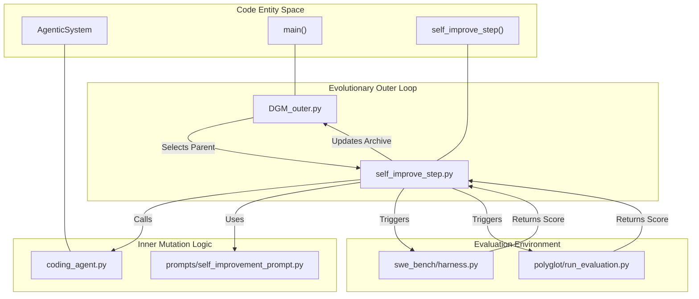
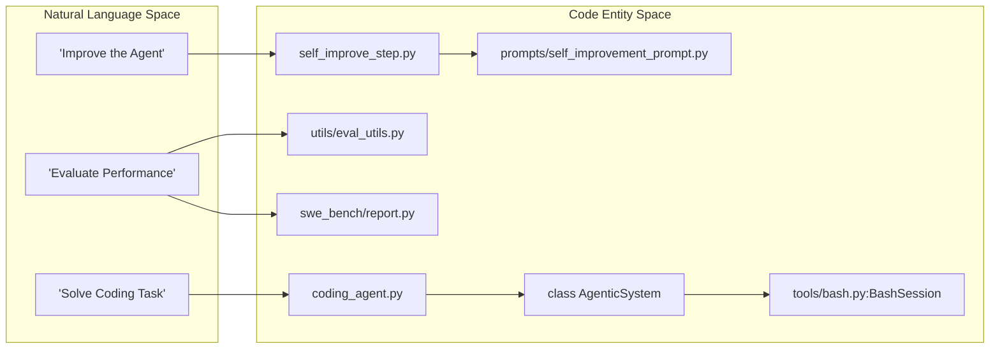

# Darwin Gödel Machine (DGM) — Project Overview

The **Darwin Gödel Machine (DGM)** is a framework for open-ended evolution of self-improving agents. It implements a recursive self-improvement loop where an agent modifies its own source code to improve its performance on complex coding benchmarks. Unlike static agents, the DGM treats its own implementation as a mutable substrate, using evolutionary strategies to select and propagate successful architectural changes [README.md:14-15]().

The system evaluates these self-modifications against two primary tracks: **SWE-bench** (software engineering tasks) and **Polyglot** (multi-language coding tasks) [README.md:75-76]().

### High-Level Architecture

The DGM operates through a "Meta-Evolutionary" loop. An outer orchestration script manages a population (archive) of agent versions, while an inner "Self-Improvement Step" uses LLMs to diagnose weaknesses in the current agent and propose code-level mutations.

#### System Workflow Diagram
This diagram illustrates how the core Python modules interact to move from a baseline agent to a self-improved generation.

**Sources:** [DGM_outer.py:1-20](), [self_improve_step.py:1-30](), [README.md:71-82]()

### Key Concepts

*   **Recursive Self-Improvement**: The agent is provided with its own source code and tools (like an editor and bash shell) to modify that code [README.md:14-15]().
*   **The Archive**: A collection of agent versions stored as git commits, tracked in `dgm_metadata.jsonl`.
*   **Darwinian Selection**: The system uses performance metrics from benchmarks to decide which "mutations" (code changes) should serve as parents for the next generation [DGM_outer.py:1-10]().
*   **The Coding Agent**: The core `AgenticSystem` class that defines how the model interacts with tools to solve tasks [coding_agent.py:1-20]().

### Subsystem Overview

#### 1. Evolutionary Orchestration
The entry point of the system is `DGM_outer.py`. It manages the lifecycle of the experiment, including parallelizing evaluation runs and maintaining the metadata of all discovered agent variants [README.md:66-68]().
*   For details, see [DGM Outer Loop — Evolution Orchestration (DGM_outer.py)](02.1-dgm-outer-loop.md).

#### 2. The Self-Improvement Pipeline
The `self_improve_step.py` script handles the logic of taking a parent agent, identifying a "problem" or "opportunity for improvement" based on previous logs, and generating a new version of the code [README.md:34-34]().
*   For details, see [Self-Improvement Step — Diagnosis and Code Mutation (self_improve_step.py)](02.3-self-improvement-step.md).

#### 3. Agent Capabilities and Tools
The agent interacts with the world through a set of tools defined in the `tools/` directory, primarily a `BashSession` for command execution and an `Editor` for file manipulation [README.md:79-79]().
*   For details, see [Agent Tools — Bash and Editor (tools/)](03.2-agent-tools.md).

#### 4. Benchmarks
The DGM validates its improvements using:
*   **SWE-bench**: Real-world GitHub issues from popular Python repositories [README.md:52-58]().
*   **Polyglot**: A multi-language benchmark testing the agent across different programming environments [README.md:60-63]().
*   For details, see [Benchmarks and Evaluation](04-benchmarks-and-evaluation.md).

### Code-to-Concept Mapping

The following diagram maps high-level conceptual roles to the specific code entities that implement them.

**Sources:** [coding_agent.py:1-50](), [self_improve_step.py:1-50](), [utils/eval_utils.py:1-20](), [tools/bash.py:1-30]()

### Child Pages
For deeper technical dives, please refer to the following pages:

*   [Getting Started — Setup, Configuration, and Running DGM](01.1-getting-started.md): Environment setup, API keys, and initial run instructions.
*   [Repository Structure and Key Files](01.2-repository-structure.md): A detailed map of the codebase and file responsibilities.
*   [Core Architecture — The Evolutionary Self-Improvement Loop](02-core-architecture.md): Detailed breakdown of the evolutionary loop and the inner coding agent.
*   [LLM Integration — Models, Clients, and Tool-Calling](03-llm-integration.md): Documentation on model clients, tool-calling, and prompt templates.
*   [Benchmarks and Evaluation](04-benchmarks-and-evaluation.md): Deep dive into SWE-bench and Polyglot integrations.
*   [Utilities and Infrastructure](05-utilities-and-infrastructure.md): Docker management, git utilities, and testing frameworks.
*   [Analysis and Visualization (analysis/)](06-analysis-and-visualization.md): Tools for plotting progress and visualizing the archive tree.
*   [Glossary — Key Terms, Jargon, and Code Pointers](07-glossary.md): Definitions of key terms and code pointers.
