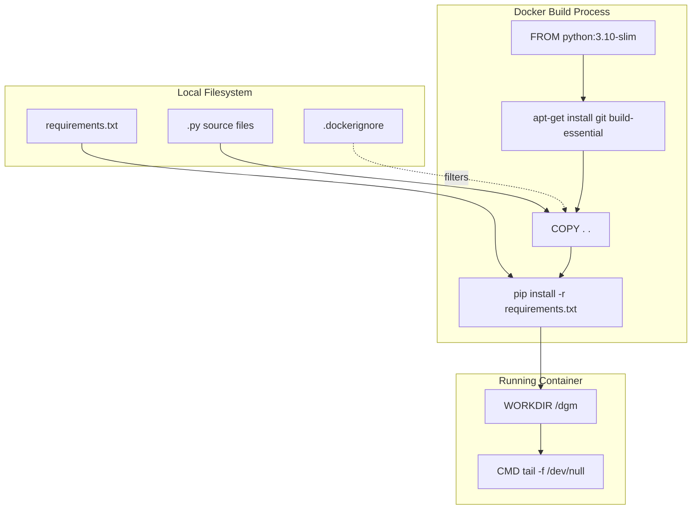
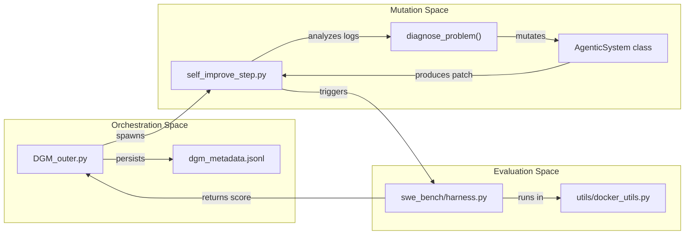

# Getting Started — Setup, Configuration, and Running DGM

This page provides a step-by-step technical guide for onboarding engineers to the Darwin Gödel Machine (DGM) codebase. It covers the environment requirements, dependency management, API configuration, and the process for launching the initial evolutionary self-improvement loop.

## Environment Prerequisites

The DGM system requires a Linux-based environment (or WSL2) with Python 3.10 and Docker installed. Docker is critical as the system executes model-generated code within isolated containers to evaluate performance and safety [Dockerfile:1-20](https://github.com/hexo-ai/dgm/blob/main/Dockerfile#L1-L20).

### 1. API Key Configuration
DGM supports multiple LLM providers. You must export the relevant API keys to your environment. These keys are consumed by the LLM abstraction layer to facilitate agent reasoning and code mutation [README.md:25-29](https://github.com/hexo-ai/dgm/blob/main/README.md#L25-L29).

```bash
# Add these to your ~/.bashrc or ~/.zshrc
export OPENAI_API_KEY='your_openai_key'
export ANTHROPIC_API_KEY='your_anthropic_key'
# Optional: AWS_ACCESS_KEY_ID, AWS_SECRET_ACCESS_KEY for Bedrock
# Optional: GOOGLE_APPLICATION_CREDENTIALS for Vertex AI
```

### 2. Docker Setup
Ensure your user has permissions to run Docker without `sudo`, as the Python `subprocess` calls within the evaluation harness expect standard user access [README.md:31-38](https://github.com/hexo-ai/dgm/blob/main/README.md#L31-L38).

```bash
# Verify Docker installation
docker run hello-world
 
# If permission denied, add user to docker group
sudo usermod -aG docker $USER
newgrp docker
```

## Installation and Dependency Management

The project uses a standard `requirements.txt` for core logic and a `requirements_dev.txt` for analysis and visualization tools [README.md:41-49](https://github.com/hexo-ai/dgm/blob/main/README.md#L41-L49).

### 1. Core Dependencies
```bash
python3 -m venv venv
source venv/bin/activate
pip install -r requirements.txt
```

### 2. External Benchmarks
DGM evaluates its self-improvement steps against two primary benchmarks: **SWE-bench** and **Polyglot**. These must be cloned and initialized locally [README.md:52-63](https://github.com/hexo-ai/dgm/blob/main/README.md#L52-L63).

*   **SWE-bench**: Used for software engineering task evaluation. The system requires a specific commit of the SWE-bench repository to ensure compatibility with the evaluation harness [README.md:52-58](https://github.com/hexo-ai/dgm/blob/main/README.md#L52-L58).
*   **Polyglot**: Used for multi-language coding tasks. This requires running a preparation script to configure the dataset and modify CMake files for the local environment [README.md:60-63](https://github.com/hexo-ai/dgm/blob/main/README.md#L60-L63).

### 3. System Visualization Tools (Optional)
To generate lineage graphs and progress plots, you must install Graphviz [README.md:46-49](https://github.com/hexo-ai/dgm/blob/main/README.md#L46-L49).
```bash
sudo apt-get install graphviz graphviz-dev
pip install -r requirements_dev.txt
```

**Sources:** [README.md:24-63](https://github.com/hexo-ai/dgm/blob/main/README.md#L24-L63), [Dockerfile:1-20](https://github.com/hexo-ai/dgm/blob/main/Dockerfile#L1-L20)

---

## The DGM Containerization Model

DGM uses a "Persistence Model" for its Docker containers. Instead of spinning up a container for every single command, it builds a base image and keeps a container running using `tail -f /dev/null` [Dockerfile:19-20](https://github.com/hexo-ai/dgm/blob/main/Dockerfile#L19-L20). The system then executes commands inside this running container via `docker exec` calls managed by `utils/docker_utils.py`.

### Container Build Flow
The following diagram illustrates how the local codebase is packaged into the DGM execution environment.

**Diagram: DGM Environment Packaging**

**Sources:** [Dockerfile:1-20](https://github.com/hexo-ai/dgm/blob/main/Dockerfile#L1-L20), [.dockerignore:1-39](https://github.com/hexo-ai/dgm/blob/main/.dockerignore#L1-L39)

---

## Running the Outer Loop

The entry point for the entire evolutionary process is `DGM_outer.py` [README.md:65-68](https://github.com/hexo-ai/dgm/blob/main/README.md#L65-L68). When launched, it initializes the archive with baseline performance data from the `initial/` (SWE-bench) or `initial_polyglot/` directories [README.md:71-76](https://github.com/hexo-ai/dgm/blob/main/README.md#L71-L76).

### Initial Execution
```bash
python DGM_outer.py
```

### Data Flow: From Launch to Self-Improvement
The diagram below maps the natural language concept of "Evolutionary Loop" to the specific code entities that handle the data flow.

**Diagram: DGM Execution Data Flow**


### Key Components in the Loop
1.  **`DGM_outer.py`**: The main orchestrator. It manages the population of agents (stored as git commits/patches) and selects parents for the next generation [README.md:81](https://github.com/hexo-ai/dgm/blob/main/README.md).
2.  **`self_improve_step.py`**: Handles the logic for a single "mutation." It identifies weaknesses in the current agent and prompts an LLM to rewrite the agent's code [README.md:34](https://github.com/hexo-ai/dgm/blob/main/README.md).
3.  **`coding_agent.py`**: Contains the `AgenticSystem` class, which is the actual "organism" being evolved. This is the code that gets modified by the DGM [README.md:80](https://github.com/hexo-ai/dgm/blob/main/README.md).
4.  **`output_dgm/`**: The default directory where all logs, patches, and metadata for the run are stored [README.md:69](https://github.com/hexo-ai/dgm/blob/main/README.md).

**Sources:** [README.md:65-82](https://github.com/hexo-ai/dgm/blob/main/README.md#L65-L82), [DGM_outer.py:1-50](https://github.com/hexo-ai/dgm/blob/main/DGM_outer.py#L1-L50), [self_improve_step.py:1-50](https://github.com/hexo-ai/dgm/blob/main/self_improve_step.py#L1-L50)

---

## Safety and Resource Cleanup

Because DGM executes model-generated code, it is vital to monitor running containers.

1.  **Isolation**: All evaluations happen inside Docker to prevent the agent from affecting the host system [Dockerfile:1-20](https://github.com/hexo-ai/dgm/blob/main/Dockerfile#L1-L20).
2.  **Cleanup**: If the process is interrupted, you may have orphaned containers. You can clean them up using:
    ```bash
    docker rm -f $(docker ps -a -q --filter "ancestor=dgm_image")
    ```
3.  **Exclusions**: The `.dockerignore` file ensures that large log files and sensitive `.env` files are not leaked into the container image during the build process [.dockerignore:1-7](https://github.com/hexo-ai/dgm/blob/main/.dockerignore#L1-L7), [.dockerignore:10-23](https://github.com/hexo-ai/dgm/blob/main/.dockerignore#L10-L23).

**Sources:** [README.md:87-89](https://github.com/hexo-ai/dgm/blob/main/README.md#L87-L89), [.dockerignore:1-39](https://github.com/hexo-ai/dgm/blob/main/.dockerignore#L1-L39), [Dockerfile:1-20](https://github.com/hexo-ai/dgm/blob/main/Dockerfile#L1-L20)
