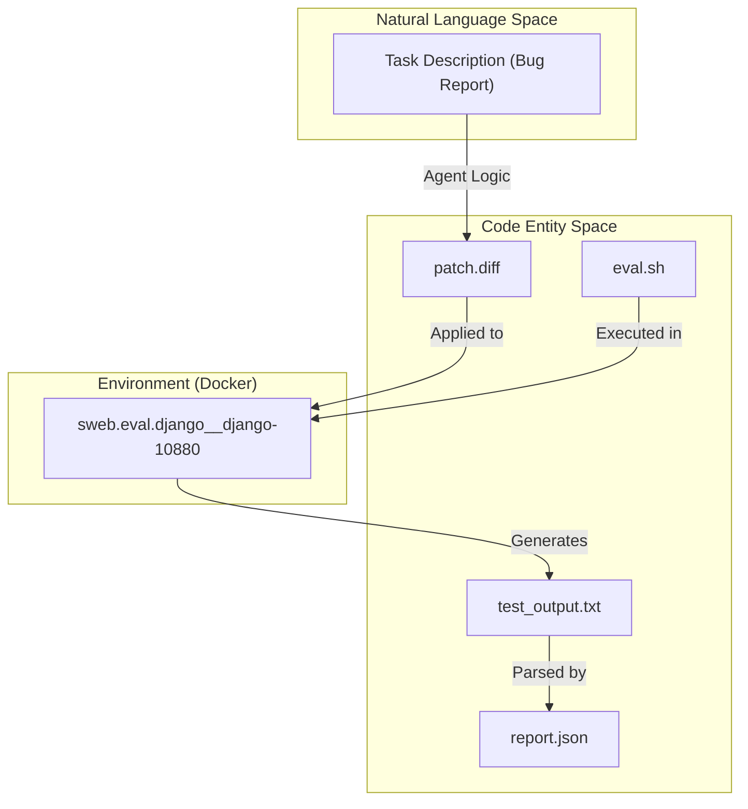
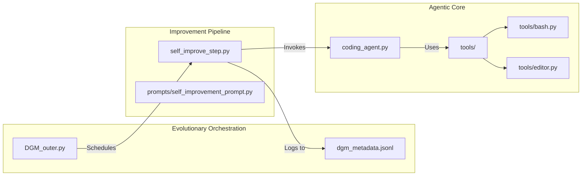

# Repository Structure and Key Files

This page provides a technical map of the Darwin Gödel Machine (DGM) repository. It details the organization of source code, configuration files, and the structure of the baseline evaluation artifacts that anchor the evolutionary process.

## Top-Level Directory Overview

The repository is organized into functional modules that separate the evolutionary logic, agentic tools, benchmark integrations, and analysis utilities.

| Directory | Role |
| :--- | :--- |
| `analysis/` | Scripts for visualizing the archive and plotting experiment progress. |
| `initial/` | Baseline snapshot containing the starting point for the evolutionary loop. |
| `polyglot/` | Integration for the Polyglot benchmark (multi-language evaluation). |
| `prompts/` | LLM prompt templates for diagnosis and self-improvement. |
| `swe_bench/` | Integration for the SWE-bench benchmark and evaluation harness. |
| `tests/` | Unit tests for core tools like the Bash session and Editor. |
| `tools/` | Implementation of agentic tools (Bash, Editor) used by the Coding Agent. |
| `utils/` | Shared utility functions for Docker, Git, and evolutionary metadata. |

**Sources:**
- `analysis/`
- `initial/`
- `polyglot/`
- `prompts/`
- `swe_bench/`
- `tools/`
- `utils/`

## Configuration and Artifact Management

The repository uses standard Git configuration files to manage large artifacts and environment exclusions.

### Git LFS and Attributes
The file `.gitattributes` identifies large binary files managed via Git LFS. Specifically, the SWE-bench results archive is tracked to avoid bloating the primary repository history while maintaining access to evaluation data.
- `misc/swe_results.zip`: Filtered and merged via LFS `[.gitattributes:1-1]()`.

### Exclusions (.gitignore)
The `.gitignore` file prevents local environment artifacts, logs, and temporary benchmark data from being committed. Key exclusions include:
- **Execution Logs:** `logs/`, `output_selfimprove/`, `output_dgm/` `[.gitignore:6,16,17]()`.
- **Benchmark Data:** `swe_bench/repos/`, `swe_bench/SWE-bench/`, and `polyglot/predictions/` `[.gitignore:10,11,24]()`.
- **Virtual Environments:** `venv/` and `__pycache__/` `[.gitignore:1,4]()`.

**Sources:**
- `[.gitattributes:1-1]()`
- `[.gitignore:1-27]()`

## The Baseline Snapshot (`initial/`)

The `initial/` directory contains the "Generation 0" artifacts. This is the baseline from which the DGM begins its recursive self-improvement. It contains the initial code state and the results of the first evaluation run.

### Evaluation Artifact Structure
For every task instance (e.g., a specific Django bug in SWE-bench), the baseline includes a dedicated directory under `initial/logs/run_evaluation/`. Using `django__django-10880` as an example, the following files are present:

| File | Role |
| :--- | :--- |
| `patch.diff` | The actual code change generated by the agent for this instance `[initial/logs/run_evaluation/initial_0/initial_0/django__django-10880/patch.diff:1-21]()`. |
| `eval.sh` | The shell script generated to set up the environment and run the tests within the container `[initial/logs/run_evaluation/initial_0/initial_0/django__django-10880/eval.sh:1-48]()`. |
| `report.json` | A structured summary of the evaluation results, including `resolved` status and test breakdowns `[initial/logs/run_evaluation/initial_0/initial_0/django__django-10880/report.json:1-85]()`. |
| `test_output.txt` | The raw stdout/stderr from the test execution inside the Docker container `[initial/logs/run_evaluation/initial_0/initial_0/django__django-10880/test_output.txt:1-182]()`. |
| `run_instance.log` | Orchestration logs showing container creation, patch application, and grading `[initial/logs/run_evaluation/initial_0/initial_0/django__django-10880/run_instance.log:1-60]()`. |

### Data Flow: From Evaluation to Metadata
The following diagram illustrates how the files in the `initial/` directory represent the state of the system at the start of an evolutionary run.

**Initial State Data Flow**

**Sources:**
- `[initial/logs/run_evaluation/initial_0/initial_0/django__django-10880/patch.diff:1-21]()`
- `[initial/logs/run_evaluation/initial_0/initial_0/django__django-10880/eval.sh:1-48]()`
- `[initial/logs/run_evaluation/initial_0/initial_0/django__django-10880/report.json:1-85]()`
- `[initial/logs/run_evaluation/initial_0/initial_0/django__django-10880/test_output.txt:1-182]()`
- `[initial/logs/run_evaluation/initial_0/initial_0/django__django-10880/run_instance.log:1-60]()`

## Mapping Subsystems to Code Entities

The DGM operates by bridging high-level evolutionary concepts with specific Python implementations.

### System Mapping Diagram
This diagram maps the logical components of the DGM to their corresponding file locations and primary classes/functions.

**DGM System Mapping**

### Key File Roles
*   **`DGM_outer.py`**: The entry point for the evolutionary loop. It manages the archive of versions and selects parents for the next generation.
*   **`coding_agent.py`**: Contains the `AgenticSystem` class, which defines how the LLM interacts with the codebase using tools.
*   **`self_improve_step.py`**: Implements the logic for diagnosing a failure and attempting to mutate the agent's code or prompts to fix it.
*   **`tools/bash.py`**: Implements `BashSession`, providing a persistent, stateful shell environment for the agent `[tests/test_bash_tool.py]()`.
*   **`tools/editor.py`**: Provides the `Editor` tool, allowing the agent to view and modify files with safety checks.

**Sources:**
- `DGM_outer.py`
- `coding_agent.py`
- `self_improve_step.py`
- `tools/bash.py`
- `tools/editor.py`
- `tests/test_bash_tool.py`
