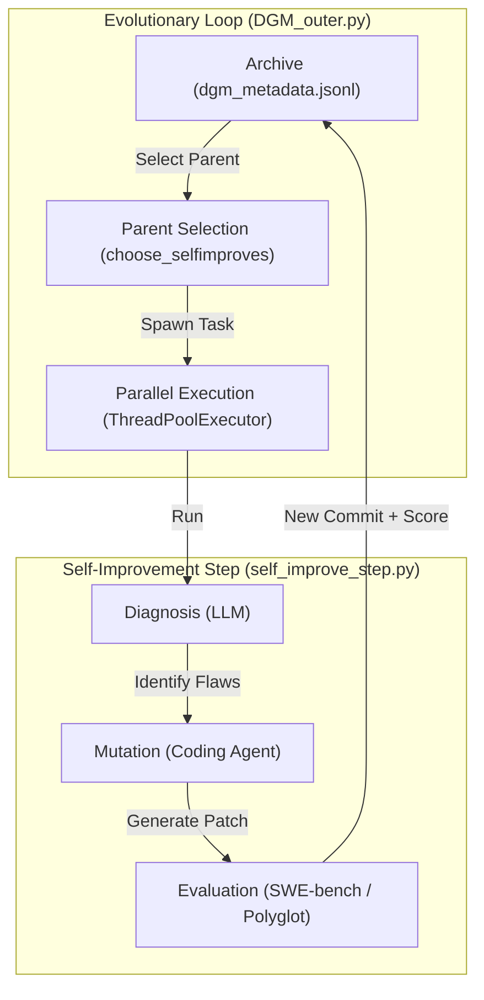
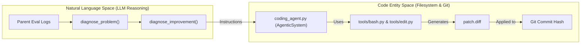

# Core Architecture — The Evolutionary Self-Improvement Loop

The Darwin Gödel Machine (DGM) is designed as a recursive, self-improving system. Its architecture consists of two primary nested loops: an **Outer Loop** that manages an evolving archive of codebase versions, and an **Inner Agent** that performs the actual code modifications. This structure allows the system to not only solve external programming benchmarks but also to modify its own source code to improve its performance on those benchmarks.

### High-Level Architecture Overview

The DGM operates by treating its own codebase as an evolvable artifact. It maintains a population of "commits" (versions of the DGM source code), evaluates them against benchmarks, and uses the best-performing versions as parents for the next generation of improvements.

#### Diagram: The Recursive Evolution Loop
This diagram illustrates the relationship between the evolutionary orchestration and the code modification process.

**Sources:** [DGM_outer.py:50-150](https://github.com/hexo-ai/dgm/blob/main/DGM_outer.py#L50-L150), [DGM_outer.py:228-270](https://github.com/hexo-ai/dgm/blob/main/DGM_outer.py#L228-L270), [README.md:14-18](https://github.com/hexo-ai/dgm/blob/main/README.md#L14-L18)

---

### The Outer Loop: Evolution Orchestration
The outer loop, implemented in `DGM_outer.py`, acts as the "Darwinian" engine. It manages the lifecycle of the experiment, handles parallelization, and maintains the global metadata of all generated agents.

Key responsibilities include:
*   **Archive Management**: Tracking every version of the agent and its performance in `dgm_metadata.jsonl` [DGM_outer.py:22-25](https://github.com/hexo-ai/dgm/blob/main/DGM_outer.py#L22-L25).
*   **Parent Selection**: Choosing which existing agent versions should be "mutated" next using strategies like `score_prop` (probability based on accuracy) or `best` (greedy selection) [DGM_outer.py:83-106](https://github.com/hexo-ai/dgm/blob/main/DGM_outer.py#L83-L106).
*   **Parallelization**: Using `ThreadPoolExecutor` to run multiple self-improvement steps simultaneously [DGM_outer.py:228-230](https://github.com/hexo-ai/dgm/blob/main/DGM_outer.py#L228-L230).

For details, see [DGM Outer Loop — Evolution Orchestration (DGM_outer.py)](02.1-dgm-outer-loop.md).

**Sources:** [DGM_outer.py:1-110](https://github.com/hexo-ai/dgm/blob/main/DGM_outer.py#L1-L110), [DGM_outer.py:228-240](https://github.com/hexo-ai/dgm/blob/main/DGM_outer.py#L228-L240)

---

### The Inner Agent: Coding System
The "Inner Agent" is the actual `AgenticSystem` class defined in `coding_agent.py`. This is the part of the code that the DGM is trying to improve. It is a tool-augmented LLM agent capable of browsing a repository, editing files, and running tests.

The agent's primary execution flow is the `forward()` method [coding_agent.py:153-169](https://github.com/hexo-ai/dgm/blob/main/coding_agent.py#L153-L169), which:
1.  Receives a problem statement and a repository path.
2.  Uses `chat_with_agent` to interact with a foundation model (e.g., Claude 3.5 Sonnet) [coding_agent.py:169](https://github.com/hexo-ai/dgm/blob/main/coding_agent.py).
3.  Utilizes a suite of tools (Bash, Editor) to explore and modify the target code.

For details, see [Coding Agent — The Inner Agent (coding_agent.py & coding_agent_polyglot.py)](02.2-coding-agent.md).

**Sources:** [coding_agent.py:67-93](https://github.com/hexo-ai/dgm/blob/main/coding_agent.py#L67-L93), [coding_agent.py:153-170](https://github.com/hexo-ai/dgm/blob/main/coding_agent.py#L153-L170)

---

### The Self-Improvement Step: Diagnosis and Mutation
The bridge between the Outer Loop and the Inner Agent is the `self_improve_step.py` pipeline. This script is responsible for taking a "Parent" version of the DGM and producing a "Child" version.

#### Diagram: Mapping Natural Language Diagnosis to Code Entities
This diagram shows how the system bridges the gap between high-level reasoning and specific code modifications during a self-improvement step.

The process involves:
1.  **Diagnosis**: Analyzing the logs of a parent's failure on a specific benchmark task [DGM_outer.py:137-141](https://github.com/hexo-ai/dgm/blob/main/DGM_outer.py#L137-L141).
2.  **Mutation**: The parent agent runs on its *own source code* to fix the identified flaw.
3.  **Verification**: The new "Child" agent is built into a new Docker container and evaluated on a subset of the benchmark to ensure the change is beneficial [DGM_outer.py:152-160](https://github.com/hexo-ai/dgm/blob/main/DGM_outer.py#L152-L160).

For details, see [Self-Improvement Step — Diagnosis and Code Mutation (self_improve_step.py)](02.3-self-improvement-step.md).

**Sources:** [DGM_outer.py:10-13](https://github.com/hexo-ai/dgm/blob/main/DGM_outer.py#L10-L13), [DGM_outer.py:50-150](https://github.com/hexo-ai/dgm/blob/main/DGM_outer.py#L50-L150), [coding_agent.py:153-170](https://github.com/hexo-ai/dgm/blob/main/coding_agent.py#L153-L170)

---

### Data Persistence and Evaluation Tiers
The DGM maintains a strict hierarchy of evaluation to manage computational costs:
*   **Shallow Evaluation**: A small subset of benchmark tasks used during the self-improvement step to quickly filter out non-functional agents [DGM_outer.py:152-160](https://github.com/hexo-ai/dgm/blob/main/DGM_outer.py#L152-L160).
*   **Full Evaluation**: A comprehensive run across the entire benchmark (e.g., SWE-bench Lite) to determine the final score of a generation.

Results are persisted in a centralized metadata file:
| File | Purpose |
| :--- | :--- |
| `dgm_metadata.jsonl` | The "Genome" of the experiment, containing the lineage and scores of every agent version [DGM_outer.py:22-25](https://github.com/hexo-ai/dgm/blob/main/DGM_outer.py#L22-L25). |
| `metadata.json` | Per-commit performance metrics, including `accuracy_score` and `resolved_ids` [DGM_outer.py:60-66](https://github.com/hexo-ai/dgm/blob/main/DGM_outer.py#L60-L66). |

**Sources:** [DGM_outer.py:22-25](https://github.com/hexo-ai/dgm/blob/main/DGM_outer.py#L22-L25), [DGM_outer.py:60-72](https://github.com/hexo-ai/dgm/blob/main/DGM_outer.py#L60-L72)
