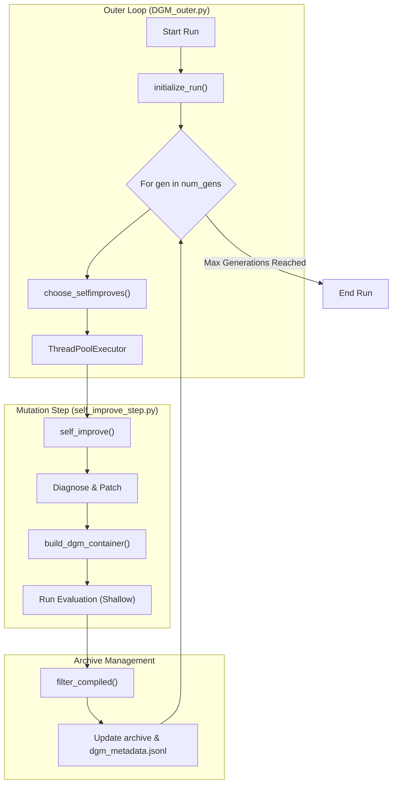
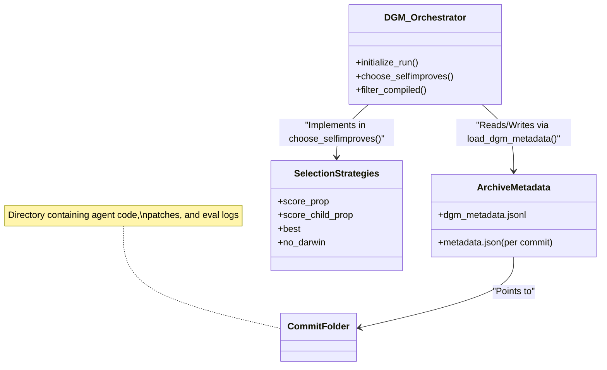

# DGM Outer Loop — Evolution Orchestration (DGM_outer.py)

The `DGM_outer.py` script serves as the primary entry point and orchestrator for the Darwin Gödel Machine's evolutionary process. It manages the high-level lifecycle of self-improvement, including parent selection from the code archive, parallel execution of mutation attempts, and the transition between generations.

## Purpose and Scope

The outer loop implements a population-based evolutionary strategy where "individuals" are versions of the `AgenticSystem` (coding agent). Each generation, the system selects promising parent versions based on their performance on benchmarks and attempts to improve them using the `self_improve` pipeline. The goal is to recursively evolve an agent that is increasingly capable of solving software engineering tasks.

## Evolution Lifecycle

The evolutionary process is structured into discrete generations. Each generation follows a specific sequence of operations to evolve the next set of agent candidates.

### 1. Initialization
The run begins by calling `initialize_run` [DGM_outer.py:15-35](). This function sets up the output directory and identifies the starting point. If a previous run directory is provided via `--prevrun_dir`, it loads the existing archive and metadata to resume evolution [DGM_outer.py:21-25](). Otherwise, it starts with the `initial` (or `initial_polyglot`) baseline [DGM_outer.py:18-19]().

### 2. Parent Selection Strategies
The function `choose_selfimproves` [DGM_outer.py:50-150]() implements several strategies to select which versions from the archive will act as parents for the next generation's mutations.

| Strategy | Description | Implementation |
| :--- | :--- | :--- |
| `score_prop` | Selection probability is proportional to the agent's accuracy score, passed through a sigmoid function. | [DGM_outer.py:83-90]() |
| `score_child_prop` | Balances performance with diversity by penalizing parents that already have many children. | [DGM_outer.py:91-100]() |
| `best` | Greedily selects the top-performing agents in the archive. | [DGM_outer.py:101-106]() |
| `no_darwin` | Ablation mode: always selects the most recent commit as the parent, mimicking a linear (non-branching) improvement. | [DGM_outer.py:79-82]() |
| `random` | Uniformly selects parents from the eligible archive. | [DGM_outer.py:108-109]() |

### 3. Generation Execution
The main loop [DGM_outer.py:214-257]() iterates through the specified number of generations. In each iteration:
1. **Selection**: It calls `choose_selfimproves` to determine which parent/task pairs to attempt [DGM_outer.py:222]().
2. **Parallel Mutation**: It uses a `ThreadPoolExecutor` to run multiple `self_improve` steps in parallel [DGM_outer.py:227-236]().
3. **Evaluation**: New commits generated by `self_improve` are evaluated against the benchmark.
4. **Archive Update**: Successful improvements (those that compile and pass evaluation) are added to the archive for future generations.

## Data Flow and Persistence

The state of the evolution is persisted in two primary ways:
1. **Commit Directories**: Every mutation attempt that results in a code change is stored in a unique directory named after its git commit hash (e.g., `<output_dir>/<commit_id>/`).
2. **`dgm_metadata.jsonl`**: A central metadata file that tracks the entire history of the run.

### Metadata Persistence
The `dgm_metadata.jsonl` file is updated at the end of every generation [DGM_outer.py:251-257](). Each entry includes:
* `generation`: The current generation index.
* `archive`: The list of all valid commit IDs currently in the evolutionary pool.
* `best_score`: The highest accuracy score achieved so far.
* `best_commit`: The ID of the agent version that achieved the best score.

Sources: `[DGM_outer.py:15-150]()`, `[DGM_outer.py:214-257]()`, `[utils/evo_utils.py:13-13]()`

## Evaluation Tiers

DGM employs two tiers of evaluation to balance computational efficiency with scoring accuracy.

### Shallow vs. Full Evaluation
* **Shallow Evaluation**: Used during the `self_improve` step to provide immediate feedback to the agent. It typically runs on a subset of the benchmark to save time.
* **Full Evaluation**: Triggered for promising candidates to determine their true performance across the entire benchmark suite.

The system filters out "unsuccessful" runs using `filter_compiled` [DGM_outer.py:152-181](), which checks if the mutated code actually compiles and produces non-empty patches. It utilizes `is_compiled_self_improve` to verify the integrity of the generated agent [DGM_outer.py:171]().

Sources: `[DGM_outer.py:152-181]()`, `[utils/evo_utils.py:13-13]()`

## System Architecture Diagram

The following diagram illustrates how the `DGM_outer.py` orchestrator interacts with the benchmark harnesses and the mutation logic.

### Evolution Loop Orchestration

Sources: `[DGM_outer.py:15-35]()`, `[DGM_outer.py:50-50]()`, `[DGM_outer.py:152-152]()`, `[DGM_outer.py:227-236]()`, `[self_improve_step.py:10-10]()`

## Code Entity Mapping

This diagram bridges the conceptual "Evolutionary Archive" with the specific files and functions that implement it.

### Archive and Selection Logic

Sources: `[DGM_outer.py:15-150]()`, `[utils/evo_utils.py:13-13]()`, `[utils/common_utils.py:11-11]()`

## Parallel Execution Detail

The `ThreadPoolExecutor` [DGM_outer.py:227]() is configured using the `args.parallel` parameter. Each worker thread executes the `self_improve` function for a specific `(parent_commit, entry_id)` pair. 

The system handles timeouts and failures gracefully:
* If a mutation attempt exceeds the `timeout` (defaulting to 14400 seconds), it is logged as a failure [DGM_outer.py:237-241]().
* The orchestrator uses `as_completed` to process results as they finish, allowing the archive to be updated incrementally within the logic of `filter_compiled`.

Sources: `[DGM_outer.py:227-241]()`
