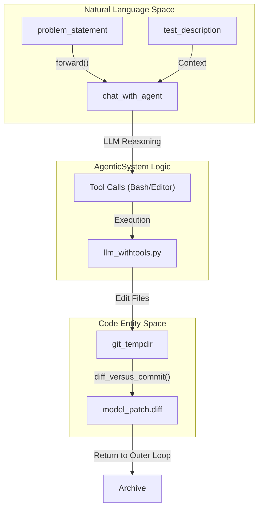
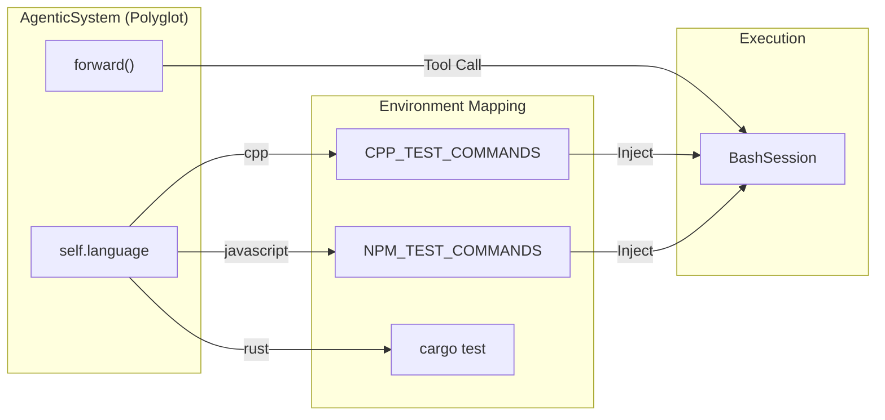

# Coding Agent — The Inner Agent (coding_agent.py & coding_agent_polyglot.py)

The Coding Agent represents the "inner loop" of the Darwin Gödel Machine. It is responsible for the actual manipulation of the codebase, tool invocation, and problem-solving logic. While the outer loop (DGM) manages evolution and selection, the Coding Agent performs the specific task of transforming a problem statement into a functional code patch.

## The AgenticSystem Class

The core logic of the inner agent is encapsulated in the `AgenticSystem` class. This class manages the state of a single coding task, including the repository path, the base commit, and the communication history with the LLM.

### Initialization and Thread-Local Logging
Because the DGM often runs multiple agents in parallel (via `ThreadPoolExecutor` in the outer loop), the agent implements a thread-safe logging mechanism using `threading.local()` [coding_agent.py:13-15](https://github.com/hexo-ai/dgm/blob/main/coding_agent.py#L13-L15).

*   **`setup_logger`**: Creates a unique logger instance named with the current thread ID [coding_agent.py:34](https://github.com/hexo-ai/dgm/blob/main/coding_agent.py).
*   **`safe_log`**: A utility that retrieves the logger from thread-local storage to ensure logs from different agents do not interleave in the same file [coding_agent.py:57-66](https://github.com/hexo-ai/dgm/blob/main/coding_agent.py#L57-L66).
*   **Log Persistence**: The conversation history is typically stored in `chat_history.md` within the task's output directory [coding_agent.py:88-92](https://github.com/hexo-ai/dgm/blob/main/coding_agent.py#L88-L92).

### The Forward Method
The `forward()` method is the entry point for the agent's execution. It constructs the initial prompt and enters the tool-calling loop.

| Component | Description |
| :--- | :--- |
| **Instruction Construction** | Combines the `problem_statement` and `test_description` into a system prompt [coding_agent.py:157-168](https://github.com/hexo-ai/dgm/blob/main/coding_agent.py#L157-L168). |
| **Tool Loop** | Calls `chat_with_agent`, which handles the iterative process of LLM reasoning and tool execution [coding_agent.py:169](https://github.com/hexo-ai/dgm/blob/main/coding_agent.py). |
| **Model Selection** | Defaults to `CLAUDE_MODEL` for standard tasks, but can switch based on the `self_improve` flag [coding_agent.py:85](https://github.com/hexo-ai/dgm/blob/main/coding_agent.py). |

**Sources:** [coding_agent.py:68-92](https://github.com/hexo-ai/dgm/blob/main/coding_agent.py#L68-L92), [coding_agent.py:153-170](https://github.com/hexo-ai/dgm/blob/main/coding_agent.py#L153-L170)

---

## Data Flow: From Natural Language to Code Patch

The agent bridges the gap between the Natural Language Space (problem descriptions) and the Code Entity Space (git commits and diffs).

### NL Space to Code Entity Space Mapping
The following diagram illustrates how the `AgenticSystem` transforms a textual problem into a physical file system change.

**Diagram: Agent Execution Flow**

**Sources:** [coding_agent.py:153-170](https://github.com/hexo-ai/dgm/blob/main/coding_agent.py#L153-L170), [coding_agent.py:182-185](https://github.com/hexo-ai/dgm/blob/main/coding_agent.py#L182-L185), [llm_withtools.py:9-10](https://github.com/hexo-ai/dgm/blob/main/llm_withtools.py#L9-L10)

---

## Tool Invocation and Diff Generation

The agent does not directly write files; it uses tools provided to the LLM. 

1.  **Tool Execution**: The `chat_with_agent` function (imported from `llm_withtools.py`) manages the loop where the LLM requests a tool (like `edit` or `bash`) and the system executes it [coding_agent.py:169](https://github.com/hexo-ai/dgm/blob/main/coding_agent.py).
2.  **State Tracking**: Throughout the process, the agent can check its progress using `get_current_edits()`, which uses `diff_versus_commit` to see what has changed relative to the `base_commit` [coding_agent.py:94-96](https://github.com/hexo-ai/dgm/blob/main/coding_agent.py#L94-L96).
3.  **Final Output**: Once the LLM finishes the conversation, the `main()` function of the script generates a final `model_patch.diff` [coding_agent.py:182-185](https://github.com/hexo-ai/dgm/blob/main/coding_agent.py#L182-L185). This patch is the primary artifact consumed by the DGM outer loop for evaluation.

### Regression Testing
In the standard `coding_agent.py`, the system includes specialized methods for regression:
*   **`get_regression_tests`**: Asks the LLM to identify existing tests in the repo that should remain passing [coding_agent.py:98-122](https://github.com/hexo-ai/dgm/blob/main/coding_agent.py#L98-L122).
*   **`run_regression_tests`**: Instructs the LLM to execute those tests and provide a report [coding_agent.py:124-151](https://github.com/hexo-ai/dgm/blob/main/coding_agent.py#L124-L151).

**Sources:** [coding_agent.py:94-151](https://github.com/hexo-ai/dgm/blob/main/coding_agent.py#L94-L151), [coding_agent.py:181-186](https://github.com/hexo-ai/dgm/blob/main/coding_agent.py#L181-L186)

---

## Polyglot Extension (`coding_agent_polyglot.py`)

The `coding_agent_polyglot.py` variant extends the base agent logic to handle multiple programming languages (C++, Java, Go, Rust, JavaScript, Python). 

### Multi-Language Support
The polyglot agent defines language-specific test commands to ensure the agent knows how to validate its work across different environments.

**Table: Polyglot Test Configurations**
| Language | Command / Logic |
| :--- | :--- |
| **Python** | `pytest -rA --tb=long` [coding_agent_polyglot.py:34](https://github.com/hexo-ai/dgm/blob/main/coding_agent_polyglot.py) |
| **Rust** | `cargo test -- --include-ignored` [coding_agent_polyglot.py:35](https://github.com/hexo-ai/dgm/blob/main/coding_agent_polyglot.py) |
| **Go** | `go test ./...` [coding_agent_polyglot.py:36](https://github.com/hexo-ai/dgm/blob/main/coding_agent_polyglot.py) |
| **JavaScript** | `npm run test` (with symlink setup for `node_modules`) [coding_agent_polyglot.py:16-22](https://github.com/hexo-ai/dgm/blob/main/coding_agent_polyglot.py#L16-L22) |
| **C++** | `cmake` followed by `make` [coding_agent_polyglot.py:24-31](https://github.com/hexo-ai/dgm/blob/main/coding_agent_polyglot.py#L24-L31) |
| **Java** | `./gradlew test` [coding_agent_polyglot.py:39](https://github.com/hexo-ai/dgm/blob/main/coding_agent_polyglot.py) |

### Implementation Differences
The polyglot `AgenticSystem` adds a `language` attribute to its constructor [coding_agent_polyglot.py:105](https://github.com/hexo-ai/dgm/blob/main/coding_agent_polyglot.py). While the `forward()` method remains similar, the environment in which it runs (managed by the outer loop's Docker infrastructure) is pre-configured with the necessary toolchains for the specified language.

**Diagram: Polyglot Toolchain Integration**

**Sources:** [coding_agent_polyglot.py:16-40](https://github.com/hexo-ai/dgm/blob/main/coding_agent_polyglot.py#L16-L40), [coding_agent_polyglot.py:97-114](https://github.com/hexo-ai/dgm/blob/main/coding_agent_polyglot.py#L97-L114), [coding_agent_polyglot.py:140-154](https://github.com/hexo-ai/dgm/blob/main/coding_agent_polyglot.py#L140-L154)
