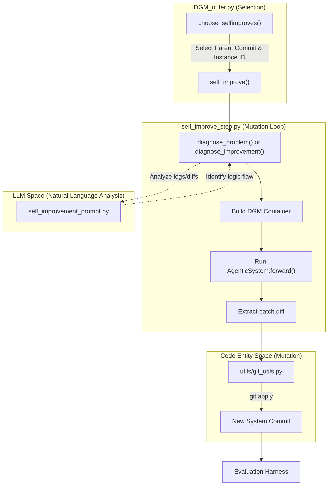
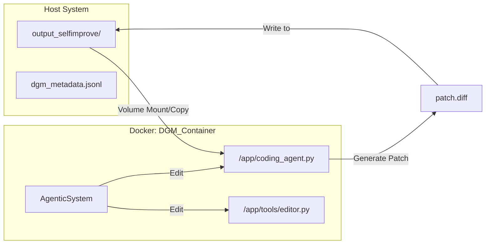

# Self-Improvement Step — Diagnosis and Code Mutation (self_improve_step.py)

The self-improvement step is the functional engine of the Darwin Gödel Machine (DGM). It is responsible for analyzing why the system failed to solve a specific programming task in a previous iteration and then autonomously modifying the system's own source code to prevent similar failures in the future. This process transitions the system from "Natural Language Space" (identifying abstract logical flaws) to "Code Entity Space" (applying concrete file diffs to the `AgenticSystem`).

## Overview of the Self-Improvement Pipeline

The self-improvement cycle is triggered by `DGM_outer.py` and executed via the `self_improve()` function in `self_improve_step.py`. The pipeline follows a structured sequence: parent selection, diagnostic analysis using LLMs, Docker-based code mutation, and result verification.

### Pipeline Flow Diagram
The following diagram illustrates the lifecycle of a single self-improvement attempt, mapping the logical steps to the specific functions and files that handle them.

**Figure 1: Self-Improvement Logic and Code Mapping**

**Sources:** [DGM_outer.py:50-150](https://github.com/hexo-ai/dgm/blob/main/DGM_outer.py#L50-L150), [self_improve_step.py:165-300](https://github.com/hexo-ai/dgm/blob/main/self_improve_step.py#L165-L300)

---

## Parent Selection and Problem Identification

Before a mutation occurs, `DGM_outer.py` must select which version of the system to improve and which failure instance to target.

### Parent Selection Strategies
The `choose_selfimproves` function implements several evolutionary strategies to pick a `parent_commit` from the archive:
*   **`score_prop`**: Probability based on the `accuracy_score` found in `metadata.json` [DGM_outer.py:83-90](https://github.com/hexo-ai/dgm/blob/main/DGM_outer.py#L83-L90).
*   **`score_child_prop`**: Balances high scores with a penalty for "over-reproduction" (number of existing children) to maintain diversity [DGM_outer.py:91-100](https://github.com/hexo-ai/dgm/blob/main/DGM_outer.py#L91-L100).
*   **`no_darwin`**: A baseline that always selects the most recent commit, simulating a linear improvement path [DGM_outer.py:79-82](https://github.com/hexo-ai/dgm/blob/main/DGM_outer.py#L79-L82).

### Targeted Problem Types
The system identifies specific categories of failure to guide the LLM's diagnosis:
1.  **`solve_empty_patches`**: Targeted when the agent failed to produce any diff for a significant portion of tasks [DGM_outer.py:125-128](https://github.com/hexo-ai/dgm/blob/main/DGM_outer.py#L125-L128).
2.  **`solve_contextlength`**: Triggered if logs indicate "Input is too long" errors (400 Bad Request) [DGM_outer.py:37-48](https://github.com/hexo-ai/dgm/blob/main/DGM_outer.py#L37-L48).
3.  **`solve_stochasticity`**: Aimed at stabilizing flaky performance [DGM_outer.py:131-134](https://github.com/hexo-ai/dgm/blob/main/DGM_outer.py#L131-L134).

**Sources:** [DGM_outer.py:50-150](https://github.com/hexo-ai/dgm/blob/main/DGM_outer.py#L50-L150)

---

## Diagnosis: Bridging Logs to Logic

The core of the self-improvement step lies in two diagnostic functions that use LLMs to translate execution logs into actionable coding plans.

### 1. `diagnose_problem()`
Used when the system is attempting to fix a failure. It retrieves the evaluation logs for a specific `instance_id` using `find_selfimprove_eval_logs` [self_improve_step.py:46-55](https://github.com/hexo-ai/dgm/blob/main/self_improve_step.py#L46-L55).
*   **Input**: The trace of the agent's attempt to solve a benchmark issue (e.g., SWE-bench logs).
*   **Process**: It provides the LLM with the system's current code and the failure log.
*   **Output**: A natural language description of why the `AgenticSystem` failed and a high-level plan for modification.

### 2. `diagnose_improvement()`
Used when comparing two versions of the system (e.g., a parent and a child) where the child performed better on some tasks but worse on others.
*   **Input**: Logs and patches from both versions [self_improve_step.py:100-115](https://github.com/hexo-ai/dgm/blob/main/self_improve_step.py#L100-L115).
*   **Process**: It uses the `diagnose_improvement_prompt.py` to identify "regressions" or "successful patterns" that should be merged or refined [prompts/diagnose_improvement_prompt.py:1-20](https://github.com/hexo-ai/dgm/blob/main/prompts/diagnose_improvement_prompt.py#L1-L20).

**Sources:** [self_improve_step.py:41-94](https://github.com/hexo-ai/dgm/blob/main/self_improve_step.py#L41-L94), [self_improve_step.py:97-153](https://github.com/hexo-ai/dgm/blob/main/self_improve_step.py#L97-L153)

---

## The Mutation Execution (Docker)

Once a diagnosis is generated, the system performs a "self-coding" task. It treats its own codebase as the repository to be edited.

### The DGM Container
To ensure safety and a clean environment, the mutation is performed inside a Docker container.
1.  **Build**: `build_dgm_container()` creates an image containing the current state of the DGM repository [utils/docker_utils.py:12-30](https://github.com/hexo-ai/dgm/blob/main/utils/docker_utils.py#L12-L30).
2.  **Run**: The system invokes its own `AgenticSystem.forward()` method, but points it at its own source code [self_improve_step.py:255-270](https://github.com/hexo-ai/dgm/blob/main/self_improve_step.py#L255-L270).
3.  **Instruction**: The prompt for this task includes the diagnosis from the previous step and the instruction to modify `coding_agent.py` or related tools to fix the identified flaw.

**Figure 2: Data Flow during Code Mutation**

### Feedback to Archive
After the mutation completes:
1.  The resulting `patch.diff` is saved to the generation's output directory.
2.  The system uses `git_utils.apply_patch()` to create a new commit [utils/git_utils.py:15-30](https://github.com/hexo-ai/dgm/blob/main/utils/git_utils.py#L15-L30).
3.  This new commit is added to the `archive` in `dgm_metadata.jsonl`, making it eligible for evaluation and future parent selection [DGM_outer.py:245-260](https://github.com/hexo-ai/dgm/blob/main/DGM_outer.py#L245-L260).

**Sources:** [self_improve_step.py:165-300](https://github.com/hexo-ai/dgm/blob/main/self_improve_step.py#L165-L300), [utils/docker_utils.py:12-50](https://github.com/hexo-ai/dgm/blob/main/utils/docker_utils.py#L12-L50), [utils/git_utils.py:1-40](https://github.com/hexo-ai/dgm/blob/main/utils/git_utils.py#L1-L40)

---

## Summary of Key Functions

| Function | File | Purpose |
| :--- | :--- | :--- |
| `self_improve()` | `self_improve_step.py` | Main entry point for a single improvement iteration. |
| `diagnose_problem()` | `self_improve_step.py` | Analyzes failure logs to generate a fix plan. |
| `choose_selfimproves()` | `DGM_outer.py` | Selects which system versions to improve based on performance. |
| `is_compiled_self_improve()` | `utils/evo_utils.py` | Validates that the mutated code actually compiles before evaluation. |

**Sources:** [self_improve_step.py:165](https://github.com/hexo-ai/dgm/blob/main/self_improve_step.py), [self_improve_step.py:41](https://github.com/hexo-ai/dgm/blob/main/self_improve_step.py), [DGM_outer.py:50](https://github.com/hexo-ai/dgm/blob/main/DGM_outer.py), [utils/evo_utils.py:13](https://github.com/hexo-ai/dgm/blob/main/utils/evo_utils.py)
