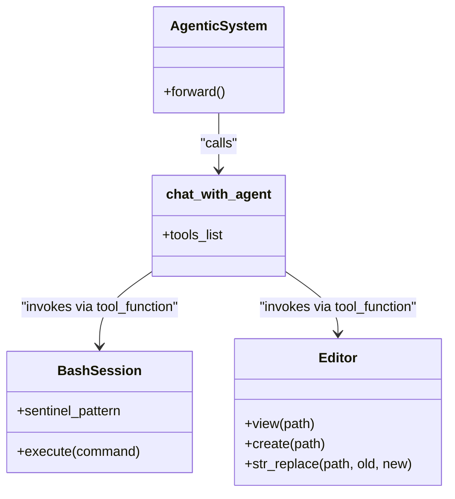

# LLM Integration — Models, Clients, and Tool-Calling

This page provides a high-level overview of how the Darwin Gödel Machine (DGM) communicates with foundation models. The system utilizes a sophisticated abstraction layer to handle multiple LLM providers and a robust tool-calling framework that allows agents to interact with the file system and shell.

## Overview of the LLM Infrastructure

The DGM relies on LLMs not just for generating code, but for self-diagnosis, evolutionary selection, and autonomous problem-solving. To manage this complexity, the system is divided into three primary components: an abstraction layer for API communication, a tool-execution framework for agent actions, and a centralized repository of prompt templates.

### Core Communication Flow

The following diagram illustrates how the system bridges the gap between high-level agent logic (Natural Language Space) and concrete system operations (Code Entity Space).

**LLM Interaction and Execution Flow**
```mermaid
graph TD
    subgraph "Natural Language Space"
        [AgenticSystem] -- "instruction" --> [chat_with_agent]
        [DGM_outer] -- "diagnose" --> [get_response_from_llm]
    end

    subgraph "Abstraction Layer (llm_withtools.py / llm.py)"
        [chat_with_agent] --> [get_response_withtools]
        [get_response_withtools] -- "loop" --> [create_client]
        [get_response_from_llm] --> [create_client]
    end

    subgraph "Code Entity Space (System Execution)"
        [get_response_withtools] -- "exec" --> [tool_function]
        [tool_function] -- "Bash" --> [BashSession]
        [tool_function] -- "Edit" --> [editor_tool]
    end

    [create_client] -- "API Call" --> LLM_Provider["Anthropic / OpenAI / Bedrock"]
```
Sources: [coding_agent.py:153-170](), [llm_withtools.py:108-158](), [llm.py:44-98]()

---

## 3.1 LLM Abstraction Layer

The abstraction layer provides a unified interface for interacting with various model providers. It handles the nuances of different API schemas (e.g., messages vs. prompts) and implements critical reliability features like exponential backoff and retry logic.

*   **Model Support:** The system supports a wide range of models including Claude (Anthropic/Bedrock/Vertex), GPT-4 series (OpenAI), and DeepSeek [llm.py:44-98]().
*   **Tool-Calling Orchestration:** The `get_response_withtools` function manages the iterative loop where a model emits a tool call, the system executes it, and the results are fed back to the model [llm_withtools.py:47-106]().
*   **Configuration:** Global constants like `CLAUDE_MODEL` and `OPENAI_MODEL` define the default foundation models used throughout the evolutionary process [llm_withtools.py:13-14]().

For details, see [LLM Abstraction Layer (llm.py and llm_withtools.py)](03.1-llm-abstraction-layer.md).

---

## 3.2 Agent Tools — Bash and Editor

To allow the LLM to act as a "Coding Agent," the system provides a set of tools located in the `tools/` directory. These tools are the primary way the agent interacts with the environment to explore repositories and apply patches.

**Tool Interface Mapping**

Sources: [coding_agent.py:153-170](), [tools/bash.py:15-45](), [tools/edit.py:20-60]()

*   **Bash Tool:** Managed via `BashSession`, it handles persistent asynchronous subprocesses, allowing the agent to maintain state across multiple shell commands while using sentinels to detect command completion [tools/bash.py:15-45]().
*   **Editor Tool:** Provides structured commands for file manipulation, including `view`, `create`, and `str_replace`. It includes safety checks for path validation and automatic output truncation for large files [tools/edit.py:20-60]().

For details, see [Agent Tools — Bash and Editor (tools/)](03.2-agent-tools.md).

---

## 3.3 Prompt Templates

Prompts are treated as first-class code entities in DGM. The `prompts/` directory contains specialized modules that define the "DNA" of the agent's behavior and the evolutionary selection criteria.

| Module | Purpose | Key Entities |
| :--- | :--- | :--- |
| `self_improvement_prompt.py` | Orchestrates the agent's meta-cognition. | `coding_agent_summary`, `diagnose` |
| `diagnose_improvement_prompt.py` | Analyzes differences between parent and child performance. | `before_after_patch_analysis` |
| `tooluse_prompt.py` | Injects tool definitions for models without native tool-calling support. | `dynamic_tool_listing` |
| `testrepo_prompt.py` | Guides the agent in extracting test commands from a repository. | `test_command_extraction` |

Sources: [README.md:77-77](), [coding_agent.py:102-114]()

The `AgenticSystem` uses these templates to structure its initial instructions and its approach to identifying regression tests [coding_agent.py:102-114]().

For details, see [Prompt Templates (prompts/)](03.3-prompt-templates.md).
