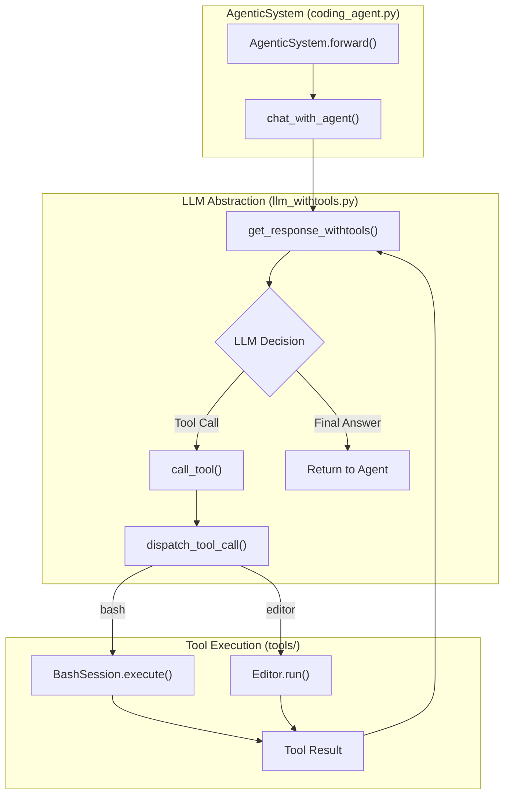
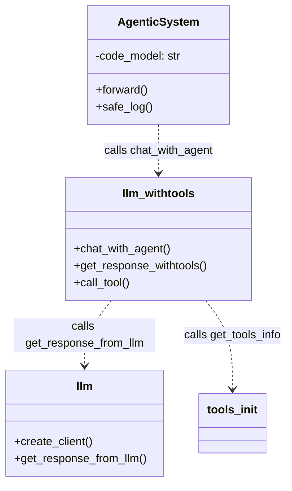

# LLM Abstraction Layer (llm.py and llm_withtools.py)

The LLM Abstraction Layer provides a unified interface for interacting with various Large Language Models (LLMs) and orchestrating tool-calling agent loops. It abstracts provider-specific SDKs (OpenAI, Anthropic, Google Vertex AI, AWS Bedrock, DeepSeek) into a consistent API and manages the stateful execution of agents that use external tools like the Bash shell and file editor.

## Core LLM Client Interface (`llm.py`)

The `llm.py` module serves as the foundational factory for LLM clients and handles raw message exchanges with various backends.

### Client Creation and Model Support
The `create_client` function initializes the appropriate SDK client based on the model string prefix [llm.py:10-31](). It supports the following providers:
*   **Anthropic**: Models starting with `claude-` [llm.py:12-14]().
*   **OpenAI**: Models starting with `gpt-` [llm.py:15-17]().
*   **DeepSeek**: Models starting with `deepseek-` [llm.py:18-20]().
*   **AWS Bedrock**: Models starting with `bedrock/` [llm.py:21-23]().
*   **Google Vertex AI**: Models starting with `vertex_ai/` [llm.py:24-26]().

### Response Generation
The `get_response_from_llm` function provides a standardized way to send a list of messages to a model and receive a text response [llm.py:33-89](). It handles:
1.  **System Prompt Extraction**: Separates the "system" role message from the message history for providers that require a distinct system parameter [llm.py:38-42]().
2.  **Provider Dispatch**: Routes the request to the specific implementation (e.g., `client.messages.create` for Anthropic or `client.chat.completions.create` for OpenAI) [llm.py:44-87]().
3.  **Error Handling**: Includes a basic try-except block to return error messages as strings if the API call fails [llm.py:88-89]().

**Sources:**
*   [llm.py:10-31]() (create_client)
*   [llm.py:33-89]() (get_response_from_llm)

## Tool-Calling Orchestration (`llm_withtools.py`)

The `llm_withtools.py` module implements the "Agentic" behavior of the DGM system, managing the loop where an LLM decides to call tools, receives their output, and continues its reasoning.

### Model Constants
The system defines default models for different tasks:
*   `CLAUDE_MODEL`: Defaults to `claude-3-5-sonnet-20240620` [llm_withtools.py:13]().
*   `OPENAI_MODEL`: Defaults to `gpt-4o-2024-05-13` [llm_withtools.py:14]().

### Agent Loop Logic
The primary entry point for agent interaction is `chat_with_agent` [llm_withtools.py:192-212](). This function wraps `get_response_withtools` and manages the message history.

The `get_response_withtools` function implements the tool-dispatch loop:
1.  **Tool Loading**: It dynamically loads available tools (Bash and Editor) using `get_tools_info` [llm_withtools.py:77-78]().
2.  **Native Tool Calling**: For models like Claude and GPT-4o, it uses the provider's native tool-calling API [llm_withtools.py:114-118]().
3.  **Backoff and Retry**: It implements an exponential backoff strategy (up to 10 retries) to handle API rate limits or transient failures [llm_withtools.py:91-112]().
4.  **Execution Loop**: If the LLM returns a tool call, the system executes the corresponding Python function via `call_tool` [llm_withtools.py:155-159](), appends the result to the history, and recurses until the LLM provides a final text response [llm_withtools.py:161-178]().

### Data Flow: Agent to Tool Execution

The following diagram illustrates how a request flows from the `AgenticSystem` through the LLM abstraction layer to the execution of a tool.

**Diagram: LLM Tool Dispatch Flow**

**Sources:**
*   [llm_withtools.py:74-180]() (get_response_withtools)
*   [llm_withtools.py:192-212]() (chat_with_agent)
*   [coding_agent.py:153-169]() (AgenticSystem.forward)

## Integration with Coding Agents

The `AgenticSystem` classes in `coding_agent.py` and `coding_agent_polyglot.py` utilize this layer to perform autonomous coding tasks.

### Thread-Safe Logging
Since the DGM outer loop runs multiple agents in parallel, `coding_agent.py` implements a thread-local logging mechanism [coding_agent.py:14-27]().
*   `setup_logger`: Creates a `RotatingFileHandler` unique to the thread ID [coding_agent.py:29-55]().
*   `safe_log`: Retrieves the thread-specific logger to ensure agent outputs (including tool calls and LLM thoughts) are captured in the correct `chat_history.md` file [coding_agent.py:57-65]().

### Model Selection Logic
The agents select models based on the task type:
*   In `coding_agent.py`, the system defaults to `CLAUDE_MODEL` [coding_agent.py:85]().
*   In `coding_agent_polyglot.py`, the system uses `CLAUDE_MODEL` for standard tasks but switches to `OPENAI_MODEL` if `self_improve` is enabled [coding_agent_polyglot.py:116]().

**Diagram: LLM Layer to Code Entity Mapping**

**Sources:**
*   [coding_agent.py:14-65]() (Thread-local logging)
*   [coding_agent.py:85]() (Default model assignment)
*   [coding_agent_polyglot.py:116]() (Polyglot model selection)
*   [llm_withtools.py:19-72]() (call_tool and tool dispatch)
