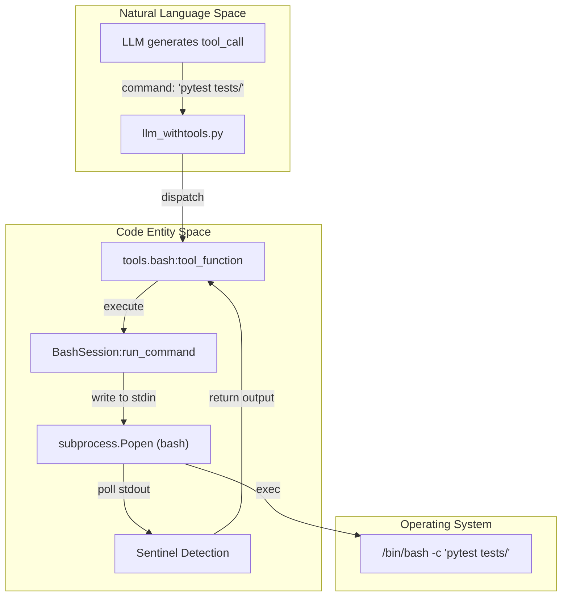
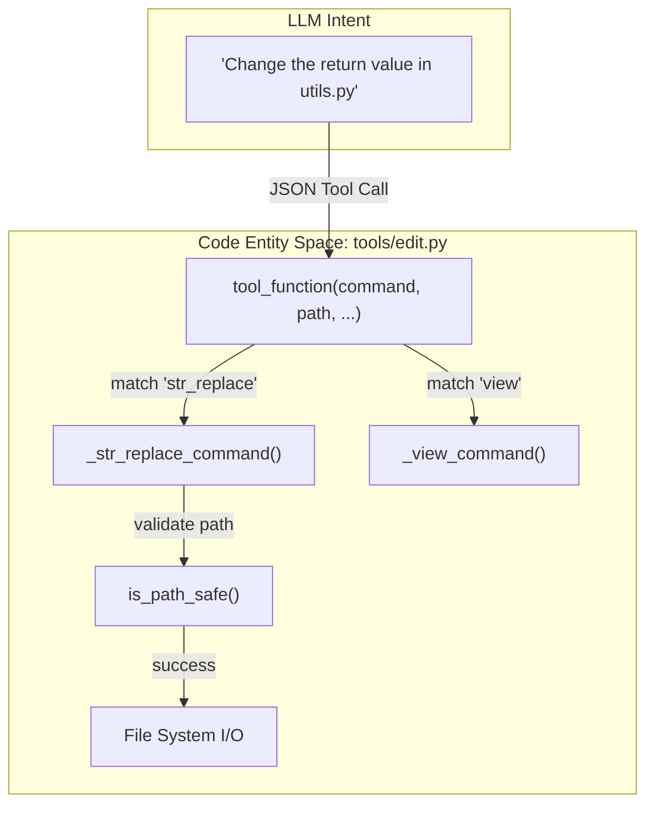

# Agent Tools — Bash and Editor (tools/)

The `tools/` directory contains the core capabilities provided to the Darwin Gödel Machine (DGM) agents. These tools allow the LLM to interact with the file system and execute code within a controlled environment. The system follows a strict interface contract where each tool provides metadata via `tool_info()` and execution logic via `tool_function()`.

## Tool Interface and Loading

All tools in the DGM ecosystem must adhere to a standard functional contract. This allows the `llm_withtools.py` dispatcher to dynamically discover and invoke tools based on the model's requirements.

### The Tool Contract
Each tool module (e.g., `bash.py`, `edit.py`) must implement:
1.  **`tool_info()`**: Returns a dictionary describing the tool's name, description, and parameter schema (following JSON Schema standards) [[tools/bash.py:10-41](), [tools/edit.py:10-101]()].
2.  **`tool_function(**kwargs)`**: The actual execution logic that processes the arguments provided by the LLM [[tools/bash.py:43-44](), [tools/edit.py:103-104]()].

### Dynamic Tool Loading
Tools are aggregated in `tools/__init__.py`. This module defines `TOOLS_INFO` and `TOOLS_MAP`, which serve as the registry for the `AgenticSystem` [[tools/__init__.py:1-12]()].

| Registry | Description |
| :--- | :--- |
| `TOOLS_INFO` | A list of metadata dictionaries used to inform the LLM of available capabilities. |
| `TOOLS_MAP` | A mapping of tool names to their respective `tool_function` implementations for dispatching calls. |

**Sources:** [[tools/bash.py:10-44](), [tools/edit.py:10-104](), [tools/__init__.py:1-12]()]

---

## Bash Tool: BashSession

The Bash tool provides a persistent shell environment for the agent. It is implemented using an asynchronous subprocess management pattern to handle long-running commands, timeouts, and output streaming.

### Implementation Details
The core of this tool is the `BashSession` class [[tools/bash.py:46-47]()]. Unlike simple `subprocess.run` calls, `BashSession` maintains a stateful `bash` process, allowing environment variables and directory changes to persist across multiple tool calls.

-   **Sentinel Pattern**: To detect the end of command execution in a persistent stream, the system appends a unique sentinel string (`END_OF_COMMAND_SENTINEL`) to every command [[tools/bash.py:49-51]()]. The tool reads from `stdout` until this sentinel is encountered [[tools/bash.py:114-128]()].
-   **Timeout Management**: Every command is governed by a `timeout` (defaulting to 120 seconds). If a command exceeds this limit, the process is terminated to prevent the agent from hanging [[tools/bash.py:108-112]()].
-   **Output Truncation**: To prevent context window overflow, the tool truncates output if it exceeds approximately 50,000 characters [[tools/bash.py:133-137]()].

### Bash Execution Flow
The following diagram illustrates how a Natural Language request for a command is translated into a `BashSession` execution.

**Diagram: Bash Tool Execution Bridge**

**Sources:** [[tools/bash.py:46-140](), [llm_withtools.py:115-130]()]

---

## Editor Tool: File Manipulation

The Editor tool (`edit.py`) provides a structured interface for the agent to view and modify the codebase. Instead of raw file writes, it uses specific commands to ensure safety and precision.

### Supported Commands
The `tool_function` in `edit.py` acts as a router for several sub-commands [[tools/edit.py:103-125]()]:

1.  **`view`**: Reads a file or directory. It supports line-range viewing to manage context window usage [[tools/edit.py:13-31]()].
2.  **`create`**: Creates a new file with specified content [[tools/edit.py:32-43]()].
3.  **`str_replace`**: Performs a search-and-replace operation. This is the primary method for code mutation in DGM [[tools/edit.py:44-68]()].
4.  **`insert`**: Inserts content at a specific line or after a matching string [[tools/edit.py:69-88]()].
5.  **`undo_edit`**: Reverts the last change made to a specific file [[tools/edit.py:89-101]()].

### Safety and Validation
The editor implements strict path validation to prevent the agent from escaping the designated working directory (`git_tempdir`). It checks that all target paths are within the authorized repository root before performing any disk I/O [[tools/edit.py:127-135]()].

**Diagram: Editor Command Routing**

**Sources:** [[tools/edit.py:10-140]()]

---

## Integration in AgenticSystem

The `AgenticSystem` (defined in `coding_agent.py`) utilizes these tools via the `chat_with_agent` function. When the agent is initialized, it is provided with the path to a temporary git directory (`git_tempdir`), which becomes the working environment for the Bash and Editor tools [[coding_agent.py:71-85]()].

### Data Flow Summary
1.  **Initialization**: `AgenticSystem` sets up the environment and logging [[coding_agent.py:88-93]()].
2.  **Inference**: The system calls `forward()`, which invokes `chat_with_agent` [[coding_agent.py:153-169]()].
3.  **Dispatch**: `llm_withtools.py` receives a tool call from the LLM, looks up the function in `TOOLS_MAP`, and executes it [[llm_withtools.py:120-125]()].
4.  **Observation**: The output (e.g., shell stdout or file content) is returned to the LLM as a "tool" role message, allowing the agent to observe the results of its actions.

**Sources:** [[coding_agent.py:67-170](), [llm_withtools.py:110-150]()]
