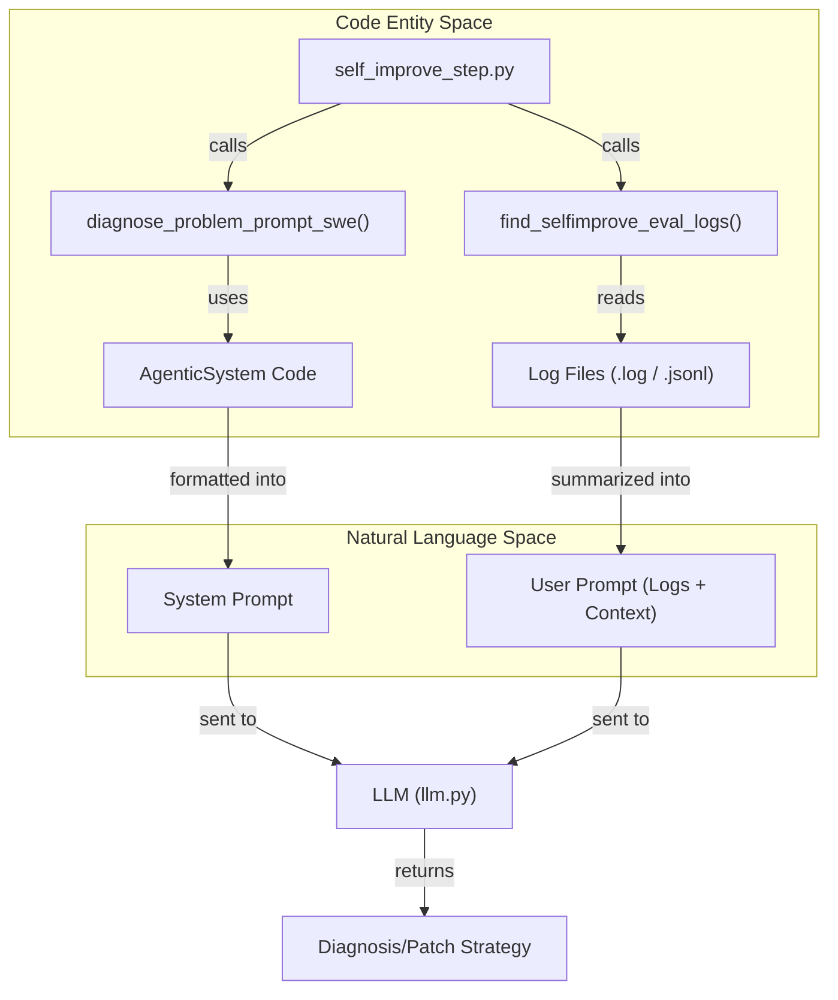
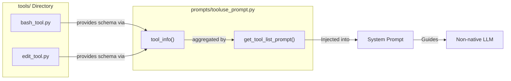

# Prompt Templates (prompts/)

The `prompts/` directory serves as the centralized repository for all natural language instructions used to guide Large Language Models (LLMs) within the Darwin Gödel Machine (DGM). These templates facilitate complex tasks such as error diagnosis, code summarization, and dynamic tool discovery.

## Overview of Prompt Modules

The DGM relies on structured prompting to maintain consistency across evolutionary generations. These prompts are designed to bridge the gap between raw execution logs and actionable engineering insights.

| Module | Primary Purpose | Key Components |
| :--- | :--- | :--- |
| `self_improvement_prompt.py` | High-level orchestration of agent analysis. | Coding agent summaries, SWE/Polyglot diagnosis, log retrieval. |
| `diagnose_improvement_prompt.py` | Comparative analysis of patches. | Before/after patch evaluation. |
| `testrepo_prompt.py` | Automated environment setup. | Extraction of test commands from repository documentation. |
| `tooluse_prompt.py` | Tool-calling support for non-native models. | Dynamic tool listing and formatting instructions. |

Sources: [prompts/self_improvement_prompt.py:1-40](https://github.com/hexo-ai/dgm/blob/main/prompts/self_improvement_prompt.py#L1-L40), [prompts/diagnose_improvement_prompt.py:1-20](https://github.com/hexo-ai/dgm/blob/main/prompts/diagnose_improvement_prompt.py#L1-L20), [prompts/tooluse_prompt.py:1-15](https://github.com/hexo-ai/dgm/blob/main/prompts/tooluse_prompt.py#L1-L15).

---

## Self-Improvement and Diagnosis (`self_improvement_prompt.py`)

This module contains the logic for generating prompts that allow the system to "reflect" on its own performance. It is used extensively by `self_improve_step.py` to identify why a coding agent failed a specific task.

### Key Functions and Logic

*   **`coding_agent_summary`**: Generates a summary of the coding agent's current state, including its core logic and recent changes.
*   **`diagnose_problem_prompt_swe`**: Specifically tailored for the SWE-bench track. It provides the LLM with the problem description, the agent's current code, and the execution logs of the failed task.
*   **`diagnose_problem_prompt_polyglot`**: A variant for the Polyglot benchmark that handles multi-language context and different test harness outputs.
*   **`find_selfimprove_eval_logs`**: A utility function that locates and reads the specific log files needed for a diagnosis step. It retrieves the interaction history between the agent and the environment.

### Data Flow: Diagnosis Generation

The following diagram illustrates how `self_improvement_prompt.py` interacts with the file system and the LLM to generate a diagnosis.

**Diagnosis Data Pipeline**

Sources: [prompts/self_improvement_prompt.py:9-48](https://github.com/hexo-ai/dgm/blob/main/prompts/self_improvement_prompt.py#L9-L48), [DGM_outer.py:9-10](https://github.com/hexo-ai/dgm/blob/main/DGM_outer.py#L9-L10), [DGM_outer.py:41-48](https://github.com/hexo-ai/dgm/blob/main/DGM_outer.py#L41-L48).

---

## Comparative Analysis (`diagnose_improvement_prompt.py`)

This module is used during the "Verification" phase of the evolutionary loop. When a new candidate agent is produced, the system compares its behavior against its parent.

*   **Implementation**: It constructs a prompt that presents the LLM with two different patches (or "thoughts") generated by two versions of the agent for the same problem.
*   **Goal**: To determine if the changes made to the agent's logic actually lead to better reasoning or more efficient tool use, even if the final outcome (pass/fail) is the same.

Sources: [prompts/diagnose_improvement_prompt.py:1-30](https://github.com/hexo-ai/dgm/blob/main/prompts/diagnose_improvement_prompt.py#L1-L30).

---

## Dynamic Tool Discovery (`tooluse_prompt.py`)

For models that do not natively support tool-calling (e.g., certain open-source models or specific versions of DeepSeek/Vertex AI), `tooluse_prompt.py` injects tool definitions directly into the system prompt.

*   **`get_tool_list_prompt`**: Iterates through the available tools in the `tools/` directory and generates a text-based documentation of their schema.
*   **Integration**: This is called by `llm_withtools.py` to ensure the model knows exactly which bash or editor commands are available and how to format the JSON blocks to trigger them.

**Tool Discovery Mapping**

Sources: [prompts/tooluse_prompt.py:1-50](https://github.com/hexo-ai/dgm/blob/main/prompts/tooluse_prompt.py#L1-L50), [llm_withtools.py:10-25](https://github.com/hexo-ai/dgm/blob/main/llm_withtools.py#L10-L25).

---

## Environment Setup (`testrepo_prompt.py`)

The `testrepo_prompt.py` module is specialized for the initial setup of a benchmark repository.

*   **Functionality**: It takes the README or INSTALL files of a repository and asks an LLM to extract the exact shell commands required to run the test suite.
*   **Output**: A clean, executable script (often `eval.sh`) that the `BashSession` tool can later use to verify agent patches.

Sources: [prompts/testrepo_prompt.py:1-40](https://github.com/hexo-ai/dgm/blob/main/prompts/testrepo_prompt.py#L1-L40).

---

## Technical Detail: Log Retrieval Logic

The `find_selfimprove_eval_logs` function in `self_improvement_prompt.py` is critical for the `DGM_outer` loop. It must handle the directory structure created during evaluation:

1.  It navigates to the `output_dir` for a specific `commit_id`.
2.  It identifies the `instance_id` (the specific SWE-bench or Polyglot task).
3.  It extracts the `md_logs` (Markdown-formatted interaction logs) and the `trajs` (raw trajectory JSON).
4.  This data is then truncated or filtered to fit within the context window of the diagnostic LLM, as checked by `any_exceeding_context_length` in `DGM_outer.py`.

Sources: [prompts/self_improvement_prompt.py:9-48](https://github.com/hexo-ai/dgm/blob/main/prompts/self_improvement_prompt.py#L9-L48), [DGM_outer.py:37-48](https://github.com/hexo-ai/dgm/blob/main/DGM_outer.py#L37-L48).
