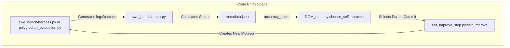
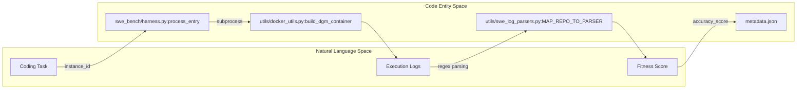

# Benchmarks and Evaluation

The Darwin Gödel Machine (DGM) relies on empirical validation to drive its evolutionary self-improvement loop. By evaluating agent performance on standardized benchmarks, the system determines which code mutations are beneficial and should be preserved in the archive. DGM currently supports two primary evaluation tracks: **SWE-bench**, focusing on real-world Python software engineering tasks, and **Polyglot**, focusing on multi-language algorithmic problem-solving.

## Evaluation Flow and the Evolutionary Loop

Evaluation results serve as the "fitness function" for the DGM. When the `DGM_outer.py` script orchestrates a generation, it triggers evaluation runs for new candidate agents. The results are aggregated into a `metadata.json` file within each candidate's directory, containing scores such as `accuracy_score`, `total_resolved_ids`, and `total_unresolved_ids` [DGM_outer.py:61-66]().

These metrics flow back into the selection logic in `choose_selfimproves`, where they influence which commits are chosen as parents for the next generation based on methods like `score_prop` (proportional to score) or `best` [DGM_outer.py:83-106]().

### Data Flow Diagram: Evaluation to Evolution
The following diagram illustrates how evaluation artifacts produced by the benchmark harnesses are consumed by the core DGM logic to guide mutation.

Sources: [DGM_outer.py:50-110](), [README.md:71-81]()

---

## SWE-bench Integration

The SWE-bench track evaluates the agent's ability to resolve real-world issues from popular GitHub repositories. DGM utilizes a modified version of the official SWE-bench harness to run evaluations within isolated Docker containers.

The integration handles:
*   **Environment Orchestration**: Setting up repo-specific Docker environments.
*   **Patch Application**: Applying the agent's generated `patch.diff` to the base repository.
*   **Test Execution**: Running the environment's test suite to verify the fix.
*   **Scoring**: Parsing logs to identify "Resolved" vs "Unresolved" instances.

DGM includes baseline evaluation artifacts in the `initial/` directory, which serve as the starting point for evolution [DGM_outer.py:28-31]().

For details, see [SWE-bench Integration (swe_bench/)](04.1-swe-bench-integration.md).

**Sources:** [DGM_outer.py:28-33](), [README.md:52-58](), [README.md:75]()

---

## Polyglot Benchmark Integration

The Polyglot track expands evaluation beyond Python, testing the agent's capability across multiple programming languages. This track uses the `polyglot/` subsystem to manage a diverse dataset of algorithmic challenges.

Key components include:
*   **Dataset Preparation**: Using `polyglot/prepare_polyglot_dataset.py` to configure CMake and extract metadata [README.md:60-63]().
*   **Multi-language Support**: Specialized handling in `coding_agent_polyglot.py` to interact with different language runtimes.
*   **Containerized Testing**: Using `polyglot/docker_build.py` to ensure consistent execution environments across languages.

The initial performance for this track is stored in `initial_polyglot/` [DGM_outer.py:28]().

For details, see [Polyglot Benchmark Integration (polyglot/)](04.2-polyglot-benchmark.md).

**Sources:** [DGM_outer.py:28-31](), [README.md:60-63](), [README.md:76]()

---

## Evaluation Infrastructure

Both benchmarks share common infrastructure for Docker management and log parsing. The system uses a persistence model where containers are kept alive via `tail -f /dev/null` to allow the agent to execute multiple commands during the "inner loop" of problem-solving.

### System Mapping: Benchmark Components
This diagram maps the high-level benchmark concepts to the specific files and functions that implement them.

Sources: [DGM_outer.py:60-66](), [README.md:71-81]()

### Summary of Benchmark Directories
| Directory | Purpose | Key Artifacts |
| :--- | :--- | :--- |
| `swe_bench/` | Python-specific GitHub issue evaluation | `harness.py`, `report.py` |
| `polyglot/` | Multi-language algorithmic evaluation | `run_evaluation.py`, `test_spec.py` |
| `initial/` | Baseline results for SWE-bench | `report.json`, `logs/` |
| `initial_polyglot/` | Baseline results for Polyglot | `report.json`, `logs/` |

**Sources:** [README.md:71-81](), [DGM_outer.py:15-35]()
