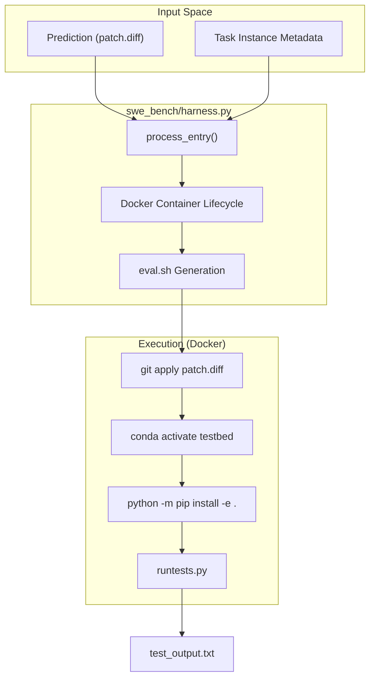
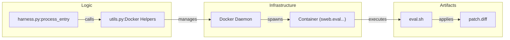

# SWE-bench Integration (swe_bench/)

The `swe_bench/` directory contains the orchestration logic for evaluating agent-generated patches against the SWE-bench benchmark. This subsystem handles the end-to-end lifecycle of a task instance: from setting up specialized Docker environments and applying patches to executing test suites and parsing results into structured reports.

## Evaluation Harness and Lifecycle

The core evaluation logic is encapsulated in `swe_bench/harness.py`. It manages the transition from a raw prediction (a git patch) to a verified score.

### Task Processing
The entry point for evaluation is `process_entry`, which orchestrates the Docker container lifecycle for a single SWE-bench instance.

1.  **Container Setup**: It identifies or builds the required environment image (e.g., `sweb.env.x86_64...`) and creates an instance-specific container [run_instance.log:1-5](https://github.com/hexo-ai/dgm/blob/main/initial/logs/run_evaluation/initial_0/initial_0/django__django-10880/run_instance.log#L1-L5).
2.  **Patch Application**: The agent's patch is written to a `patch.diff` file and applied to the codebase within the container [run_instance.log:7-11](https://github.com/hexo-ai/dgm/blob/main/initial/logs/run_evaluation/initial_0/initial_0/django__django-10880/run_instance.log#L7-L11).
3.  **Test Execution**: An `eval.sh` script is generated. This script activates the necessary Conda environment, installs the package in editable mode, and runs the specific tests defined by the SWE-bench metadata [eval.sh:1-48](https://github.com/hexo-ai/dgm/blob/main/initial/logs/run_evaluation/initial_0/initial_0/django__django-10880/eval.sh#L1-L48).
4.  **Output Capture**: Standard output and error from the test run are captured in `test_output.txt` [run_instance.log:35](https://github.com/hexo-ai/dgm/blob/main/initial/logs/run_evaluation/initial_0/initial_0/django__django-10880/run_instance.log).

### Data Flow: Evaluation Harness
The following diagram illustrates the flow of data through the `harness.py` logic.

**Figure 1: SWE-bench Harness Data Flow**

Sources: `swe_bench/harness.py`, `initial/logs/run_evaluation/initial_0/initial_0/django__django-10880/eval.sh`

## Reporting and Scoring

After execution, `swe_bench/report.py` processes the raw logs to determine if a task was resolved.

### Key Functions
*   **`load_predictions`**: Aggregates patch files from the evaluation directory.
*   **`remove_patches_to_tests`**: A safety utility that ensures agent-generated changes to the test suite itself are reverted before evaluation, preventing "cheating" where an agent might modify a test to pass.
*   **Scoring Logic**: The system categorizes tests into four states based on their transition from the base commit to the patched state:
    *   `FAIL_TO_PASS`: Tests that failed before the patch but pass after (the primary goal).
    *   `PASS_TO_PASS`: Existing tests that must remain passing (regression testing).
    *   `FAIL_TO_FAIL`: Tests that were failing and remain failing.
    *   `PASS_TO_FAIL`: Regressions introduced by the patch.

A task is marked as `resolved: true` only if all `FAIL_TO_PASS` tests succeed and no `PASS_TO_PASS` tests fail [report.json:6-30](https://github.com/hexo-ai/dgm/blob/main/initial/logs/run_evaluation/initial_0/initial_0/django__django-10973/report.json#L6-L30).

### Reporting Structure
The results are serialized into a `report.json` file for each instance.

| Field | Description |
| :--- | :--- |
| `patch_successfully_applied` | Boolean indicating if `git apply` succeeded. |
| `resolved` | Final determination of success. |
| `tests_status` | Dictionary containing lists of specific test names for each category. |

Sources: `swe_bench/report.py`, `initial/logs/run_evaluation/initial_0/initial_0/django__django-10880/report.json`

## Docker Infrastructure and Utilities

The `swe_bench/utils.py` file provides the low-level interface to the Docker daemon, ensuring thread-safe operations during parallel evaluations.

*   **Docker Helpers**: Functions to start/stop containers and execute commands inside them. The system uses a persistence model where containers are started with `tail -f /dev/null` to keep them alive for the duration of the evaluation [run_instance.log:60](https://github.com/hexo-ai/dgm/blob/main/initial/logs/run_evaluation/initial_0/initial_0/django__django-10880/run_instance.log).
*   **Thread-safe Logging**: Because `DGM_outer.py` runs evaluations in parallel using `ThreadPoolExecutor`, the logging in `swe_bench` must prevent interleaved output from different task instances.

**Figure 2: System-to-Code Entity Mapping (Docker Lifecycle)**

Sources: `swe_bench/harness.py`, `swe_bench/utils.py`, `initial/logs/run_evaluation/initial_0/initial_0/django__django-10880/run_instance.log`

## Task Subsets and Baseline Artifacts

The DGM repository includes pre-defined task subsets (JSON files) categorized by size (`small`, `medium`, `big`). These allow for varying evaluation tiers during the evolutionary loop.

### Initial Baseline
The `initial/` directory contains a snapshot of a baseline run, which serves as the "Generation 0" for the DGM evolution. These artifacts include:
*   **`predictions/`**: The initial patches generated by the base agent.
*   **`logs/run_evaluation/`**: Full execution traces for every task.
*   **`report.json`**: The summary of performance for the baseline [report.json:1-85](https://github.com/hexo-ai/dgm/blob/main/initial/logs/run_evaluation/initial_0/initial_0/django__django-10880/report.json#L1-L85).

This baseline is critical for the `DGM_outer.py` orchestration, as it provides the starting `Archive` from which parents are selected for mutation.

Sources: `initial/logs/run_evaluation/initial_0/initial_0/django__django-10880/`, `initial/logs/run_evaluation/initial_0/initial_0/django__django-10973/`
