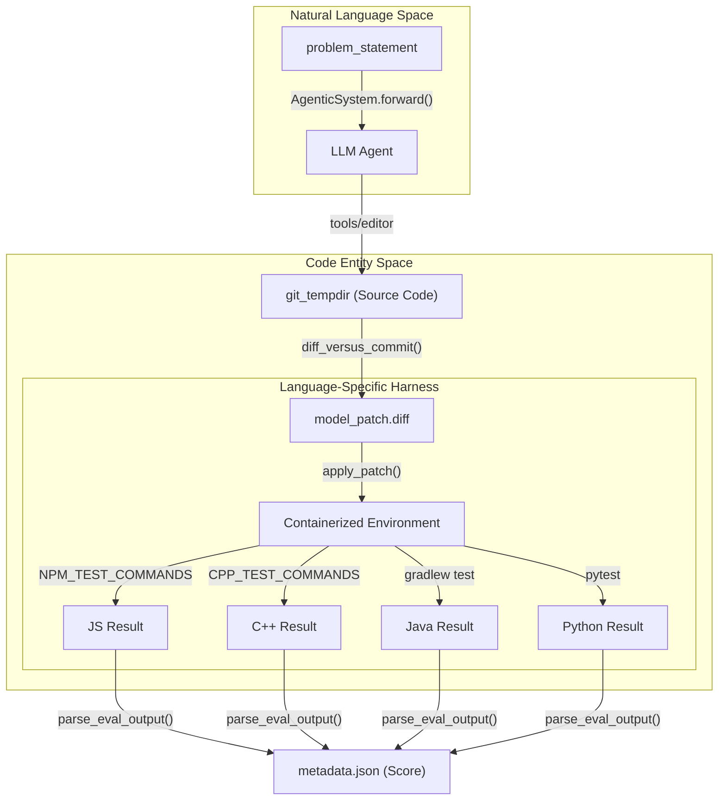
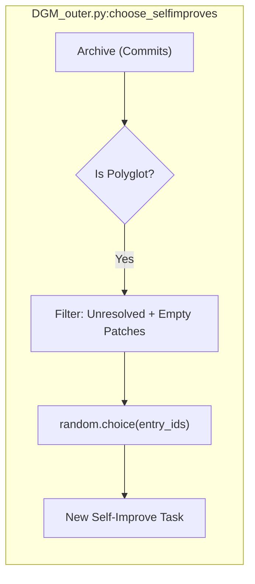

# Polyglot Benchmark Integration (polyglot/)

The Polyglot Benchmark Integration provides a multi-language evaluation framework for the Darwin Gödel Machine (DGM). While the primary focus of DGM is often on Python-based SWE-bench tasks, the `polyglot/` subsystem extends these capabilities to C++, Java, Go, Rust, and JavaScript. It utilizes a Docker-based execution environment to ensure language-specific dependencies and build tools (like CMake, Gradle, and NPM) are isolated and reproducible.

## System Overview and Data Flow

The polyglot subsystem manages the lifecycle of multi-language coding tasks, from dataset preparation and metadata extraction to containerized execution and scoring.

### Multi-Language Execution Flow
The following diagram illustrates how a task moves from the `Natural Language Space` (problem statement) to the `Code Entity Space` (compilation and testing) across different languages.

**Diagram: Polyglot Task Execution Pipeline**

Sources: [coding_agent_polyglot.py:16-40](), [coding_agent_polyglot.py:140-154](), [coding_agent_polyglot.py:181-186]()

## Key Components

### 1. Agentic System (Polyglot Variant)
The `AgenticSystem` class in `coding_agent_polyglot.py` is a specialized version of the inner coding agent. It is initialized with a `language` parameter which dictates the test commands used during the agent's internal validation phase.

*   **Language Support**: Supports `cpp`, `java`, `python`, `go`, `rust`, and `javascript` [coding_agent_polyglot.py:164]().
*   **Test Command Mapping**: Maps languages to specific CLI tools:
    *   **C++**: Uses `cmake` and `make` [coding_agent_polyglot.py:24-31]().
    *   **JavaScript**: Uses `npm run test` and handles `node_modules` symlinking [coding_agent_polyglot.py:16-22]().
    *   **Java**: Uses `./gradlew test` [coding_agent_polyglot.py:39]().
    *   **Rust**: Uses `cargo test` [coding_agent_polyglot.py:35]().

Sources: [coding_agent_polyglot.py:96-114](), [coding_agent_polyglot.py:33-40]()

### 2. Dataset Preparation
The script `polyglot/prepare_polyglot_dataset.py` (referenced in repository structure) is responsible for:
*   Cloning the `polyglot-benchmark` repository [DGM_outer.py:28-33]().
*   Extracting metadata for each task instance (language, base commit, problem statement).
*   Modifying build files (e.g., `CMakeLists.txt`) to ensure tests can be run programmatically within Docker.

### 3. Evaluation Harness (`run_evaluation.py` and `harness.py`)
The evaluation logic mirrors the SWE-bench flow but generalizes it for multiple environments.

| Function/Class | Responsibility |
| :--- | :--- |
| `run_evaluation.py` | Orchestrates the full evaluation suite across all instances in the polyglot dataset. |
| `harness.py` | Manages the lifecycle of a single task instance evaluation inside a Docker container. |
| `docker_build.py` | Generates language-specific Docker images containing the necessary compilers and runtimes. |
| `test_spec.py` | Defines the expected output format and pass/fail criteria for different language test runners. |

Sources: [DGM_outer.py:117-121](), [coding_agent_polyglot.py:14-40]()

## Integration with DGM Outer Loop

The `DGM_outer.py` script detects if it is running in polyglot mode and adjusts its archive initialization and parent selection logic accordingly.

### Initialization
When `polyglot=True`, the system looks for the `initial_polyglot` directory instead of the standard `initial` directory to load the baseline performance [DGM_outer.py:28-31]().

### Parent Selection for Evolution
The function `choose_selfimproves` handles polyglot-specific logic for selecting which failed tasks the agent should attempt to improve in the next generation:
*   **Target Selection**: For polyglot tasks, it prioritizes `empty_ids` (instances where the agent produced no patch) and `unresolved_ids` (instances where the patch failed tests) [DGM_outer.py:117-120]().
*   **Context Length Checks**: It uses `any_exceeding_context_length` to identify if failures were due to model context limits, though this is primarily used to trigger `solve_contextlength` strategies [DGM_outer.py:37-48]().

**Diagram: Polyglot Evolution Selection**

Sources: [DGM_outer.py:50-55](), [DGM_outer.py:117-121](), [DGM_outer.py:147-150]()

## Configuration and Constants

The `polyglot/constants.py` file defines the mapping between repository names and their respective languages, as well as the Docker image tags used for evaluation.

### Test Commands Configuration
The `TEST_COMMANDS` dictionary in `coding_agent_polyglot.py` provides the exact shell execution sequences required to validate a patch for a given language:

```python
TEST_COMMANDS = {
    "python": [["pytest", "-rA", "--tb=long"]],
    "rust": [["cargo", "test", "--", "--include-ignored"]],
    "go": [["go", "test", "./..."]],
    "javascript": NPM_TEST_COMMANDS,
    "cpp": CPP_TEST_COMMANDS,
    "java": [["./gradlew", "test"]],
}
```
Sources: [coding_agent_polyglot.py:33-40]()

## Baseline Predictions (`initial_polyglot/`)
The `initial_polyglot/` directory contains the results of the "Generation 0" run on the polyglot benchmark. This includes:
*   `predictions/`: The initial patches generated by the base model (e.g., Claude 3.5 Sonnet).
*   `logs/`: Detailed execution logs for every test run in every language.
*   `metadata.json`: The aggregated scores used by `DGM_outer.py` to start the evolutionary loop [DGM_outer.py:28-33]().
