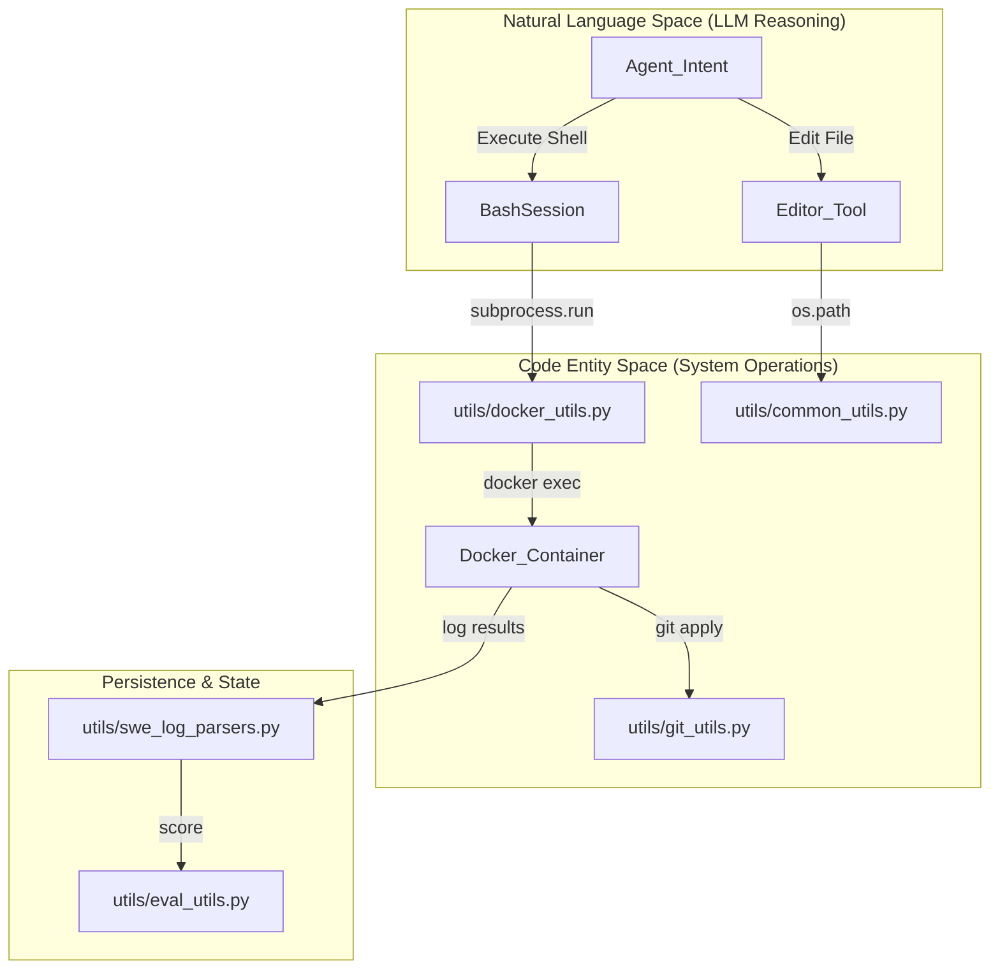
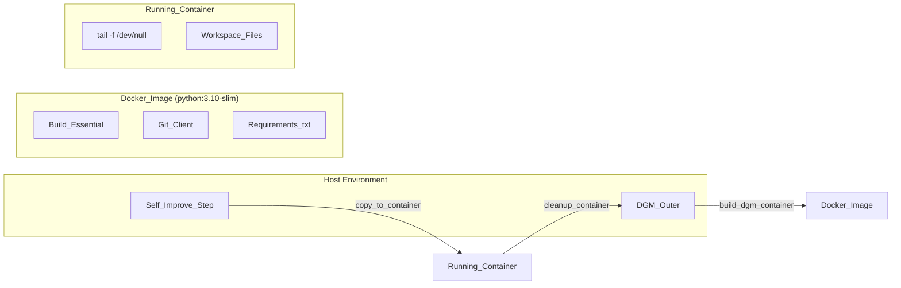

# Utilities and Infrastructure

This section provides a high-level overview of the shared utility modules and infrastructure components that support the Darwin Gödel Machine (DGM). These components handle low-level operations such as Git manipulation, Docker container orchestration, log parsing, and evaluation scoring, ensuring that the core evolutionary loop and coding agents remain decoupled from system-level implementation details.

### System Infrastructure Overview

The DGM infrastructure is designed to provide a consistent execution environment for agents and evaluation harnesses. It bridges the gap between high-level "Natural Language Space" (where the LLM reasons about improvements) and "Code Entity Space" (where files are edited, containers are built, and tests are executed).

#### Mapping Natural Language to Code Entities: Infrastructure
The following diagram illustrates how infrastructure components translate high-level agent actions into system operations.

**Infrastructure Operation Flow**

**Sources:** [utils/docker_utils.py:1-40](https://github.com/hexo-ai/dgm/blob/main/utils/docker_utils.py#L1-L40), [utils/git_utils.py:1-30](https://github.com/hexo-ai/dgm/blob/main/utils/git_utils.py#L1-L30), [utils/eval_utils.py:1-20](https://github.com/hexo-ai/dgm/blob/main/utils/eval_utils.py#L1-L20).

---

### Shared Utility Modules

The `utils/` directory contains the foundational logic used across the `DGM_outer.py` orchestration and the `coding_agent.py` execution. These modules are categorized by their functional domain:

*   **Evolutionary Utilities (`evo_utils.py`):** Handles the management of the DGM archive, including loading metadata and determining if a specific commit represents a self-improvement step [utils/evo_utils.py:1-10](https://github.com/hexo-ai/dgm/blob/main/utils/evo_utils.py#L1-L10).
*   **Git & Docker Utilities:** Provides thread-safe wrappers for `git` commands and Docker container lifecycles (build, copy, cleanup) [utils/git_utils.py:5-15](https://github.com/hexo-ai/dgm/blob/main/utils/git_utils.py#L5-L15), [utils/docker_utils.py:10-25](https://github.com/hexo-ai/dgm/blob/main/utils/docker_utils.py#L10-L25).
*   **Evaluation & Parsing:** Contains logic to parse raw test outputs from various frameworks (like `pytest`) and convert them into structured scores used for parent selection [utils/swe_log_parsers.py:5-20](https://github.com/hexo-ai/dgm/blob/main/utils/swe_log_parsers.py#L5-L20), [utils/eval_utils.py:15-35](https://github.com/hexo-ai/dgm/blob/main/utils/eval_utils.py#L15-L35).

For detailed documentation on these modules, see **[Utility Modules (utils/)](05.1-utility-modules.md)**.

---

### Docker Infrastructure

DGM relies on Docker to provide isolated, reproducible environments for both the coding agent's workspace and the evaluation of generated patches. The infrastructure is defined by a central `Dockerfile` and managed via specialized utility functions.

**Containerization Architecture**

**Sources:** [Dockerfile:1-20](https://github.com/hexo-ai/dgm/blob/main/Dockerfile#L1-L20), [utils/docker_utils.py:1-40](https://github.com/hexo-ai/dgm/blob/main/utils/docker_utils.py#L1-L40).

The `Dockerfile` utilizes a `python:3.10-slim` base [Dockerfile:2-2](https://github.com/hexo-ai/dgm/blob/main/Dockerfile#L2) and installs essential tools like `git` and `build-essential` [Dockerfile:5-8](https://github.com/hexo-ai/dgm/blob/main/Dockerfile#L5-L8). It uses a `tail -f /dev/null` persistence model to keep containers alive for multi-turn agent interactions [Dockerfile:20-20](https://github.com/hexo-ai/dgm/blob/main/Dockerfile#L20).

For details on container lifecycle management and configuration, see **[Docker Infrastructure and Containerization](05.2-docker-infrastructure.md)**.

---

### Testing Infrastructure

The `tests/` directory ensures the reliability of the DGM's own tools. It contains unit and integration tests for the bash and editor tools used by the coding agent.

*   **Bash Tool Testing:** Validates `BashSession` behavior, including command timeouts, environment variable persistence, and error handling [tests/test_bash_tool.py:1-50](https://github.com/hexo-ai/dgm/blob/main/tests/test_bash_tool.py#L1-L50).
*   **Editor Tool Testing:** Ensures the file editor can correctly view, create, and edit files while respecting path boundaries [tests/test_edit_tool.py:1-40](https://github.com/hexo-ai/dgm/blob/main/tests/test_edit_tool.py#L1-L40).

The test suite uses `pytest` fixtures defined in `conftest.py` to manage temporary directories and mock environments.

For details on running and extending the test suite, see **[Testing Infrastructure (tests/)](05.3-testing-infrastructure.md)**.

---

### Related Child Pages
- **[Utility Modules (utils/)](05.1-utility-modules.md)**: Deep dive into `evo_utils.py`, `docker_utils.py`, `git_utils.py`, `eval_utils.py`, `swe_log_parsers.py`, and `common_utils.py`.
- **[Docker Infrastructure and Containerization](05.2-docker-infrastructure.md)**: Details on the `Dockerfile`, `.dockerignore`, and container management strategies.
- **[Testing Infrastructure (tests/)](05.3-testing-infrastructure.md)**: Guide to the internal test suite for DGM tools and infrastructure.
