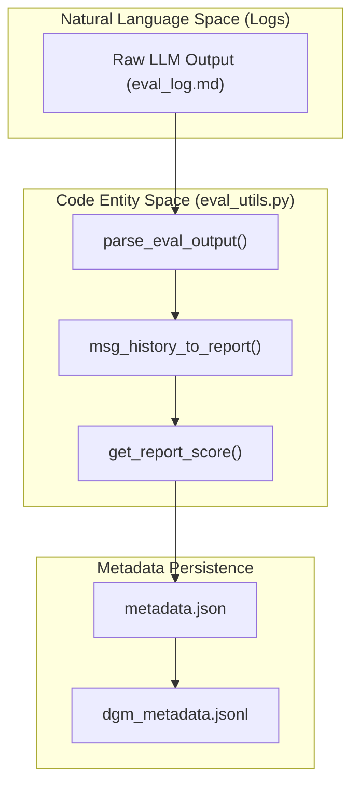
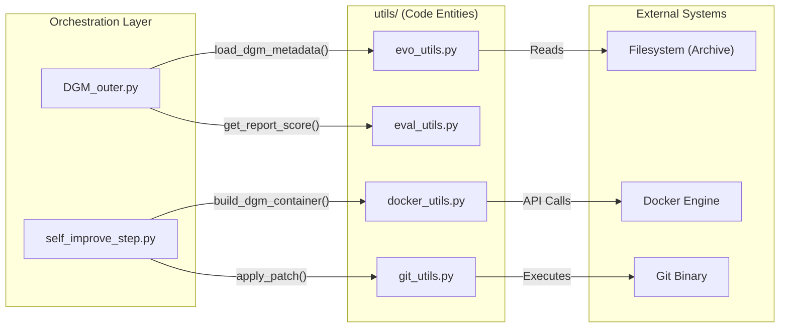

# Utility Modules (utils/)

The `utils/` directory provides the foundational infrastructure for the Darwin Gödel Machine (DGM). These modules handle low-level operations including Docker container lifecycle management, Git repository manipulation, evolutionary metadata processing, evaluation parsing, and common file I/O. These utilities are shared across the outer loop orchestration, the inner coding agent, and the benchmark harnesses.

## Evolutionary Utilities (evo_utils.py)

`evo_utils.py` manages the metadata and state of the evolutionary archive. It provides functions to track the lineage of model patches and determine the performance of different "generations" of the self-improving agent.

### Key Functions
*   **`load_dgm_metadata(metadata_path, last_only=False)`**: Parses the `dgm_metadata.jsonl` file. If `last_only` is true, it returns only the most recent archive state [utils/evo_utils.py:10-22]().
*   **`get_model_patch_paths(dgm_dir, node_id)`**: Constructs the absolute path to the `model.patch` file for a specific iteration (node) in the archive [utils/evo_utils.py:25-30]().
*   **`get_all_performance(dgm_dir, archive)`**: Aggregates accuracy scores from the `metadata.json` files of all commits currently in the archive [utils/evo_utils.py:33-47]().
*   **`is_compiled_self_improve(output_dir, run_id)`**: A safety check that verifies if a self-improvement attempt resulted in a valid `model.patch` and a successful metadata record [utils/evo_utils.py:50-62]().

**Sources:** [utils/evo_utils.py:1-62]()

---

## Docker Infrastructure Utilities (docker_utils.py)

This module encapsulates the Docker SDK to provide a clean interface for managing the ephemeral environments where the agent runs and evaluates code.

### Implementation Details
*   **`build_dgm_container(image_name, container_name, volumes)`**: Orchestrates the creation of a container from a specified image. It ensures the container remains persistent using a `tail -f /dev/null` command [utils/docker_utils.py:30-55]().
*   **`cleanup_container(client, container_name)`**: Safely stops and removes a container, handling `NotFound` exceptions gracefully [utils/docker_utils.py:102-114]().
*   **`copy_to_container` / `copy_from_container`**: Uses `tar` streams to move files between the host filesystem and the container volume without requiring manual mounts for every file [utils/docker_utils.py:58-100]().
*   **`setup_logger(log_path)`**: Provides a thread-safe logging mechanism used by `DGM_outer.py` and the evaluation harnesses to prevent log interleaving during parallel execution [utils/docker_utils.py:11-27]().

**Sources:** [utils/docker_utils.py:1-114]()

---

## Git and Patch Management (git_utils.py)

`git_utils.py` provides a wrapper around Git CLI commands to manage the state of the codebase being improved.

### Key Operations
| Function | Description | Implementation |
| :--- | :--- | :--- |
| `apply_patch` | Applies a `.patch` file to a repository. | Uses `git apply --ignore-space-change --ignore-whitespace` [utils/git_utils.py:28-40](). |
| `diff_versus_commit` | Generates a diff between current state and a commit. | Uses `git diff <commit_hash>` [utils/git_utils.py:18-25](). |
| `reset_to_commit` | Hard resets the repo to a specific state. | Uses `git reset --hard <commit_hash>` followed by `git clean -fd` [utils/git_utils.py:8-15](). |
| `get_git_commit_hash` | Retrieves the current HEAD hash. | Uses `git rev-parse HEAD` [utils/git_utils.py:43-48](). |

**Sources:** [utils/git_utils.py:1-48]()

---

## Evaluation and Scoring (eval_utils.py)

This module contains logic for interpreting the raw output of evaluation runs and converting them into structured reports and scores.

### Implementation Logic
*   **`parse_eval_output(output)`**: Scans the stdout of an evaluation script for the `{"report": ...}` JSON block, which is the standard output format for DGM evaluations [utils/eval_utils.py:6-18]().
*   **`get_report_score(report)`**: Calculates the accuracy score by dividing `resolved` instances by `total` instances [utils/eval_utils.py:44-50]().
*   **`score_tie_breaker(metadata)`**: Used when two agents have the same accuracy. It prioritizes agents that produced fewer "empty patches" (meaning they were more decisive/active) [utils/eval_utils.py:53-58]().

### Data Flow: Evaluation to Report
The following diagram illustrates how raw model outputs are transformed into the performance metrics used for selection in `DGM_outer.py`.

**Evaluation Data Flow**

**Sources:** [utils/eval_utils.py:1-58](), [DGM_outer.py:59-68]()

---

## Log Parsing (swe_log_parsers.py)

This module is specialized for the SWE-bench track. It parses the logs generated by different testing frameworks (pytest, unittest, tox) across various open-source repositories.

### Key Components
*   **`TestStatus` Enum**: Defines standardized statuses: `PASSED`, `FAILED`, `ERROR`, `SKIPPED` [utils/swe_log_parsers.py:10-14]().
*   **`MAP_REPO_TO_PARSER`**: A dictionary mapping repository names (e.g., "django/django", "scikit-learn/scikit-learn") to their specific log parsing functions [utils/swe_log_parsers.py:270-300]().
*   **`get_pytest_report`**: A robust parser that uses regex to extract test names and their outcomes from standard pytest output [utils/swe_log_parsers.py:20-80]().

**Sources:** [utils/swe_log_parsers.py:1-300]()

---

## Common Utilities (common_utils.py)

Provides basic file handling with built-in error management.

*   **`read_file(file_path)`**: Safely reads text files, returning an empty string if the file does not exist [utils/common_utils.py:4-11]().
*   **`load_json_file(file_path)`**: Safely loads JSON data, returning an empty dictionary on failure [utils/common_utils.py:14-21]().

**Sources:** [utils/common_utils.py:1-21]()

---

## System Integration Diagram

This diagram shows how the utility modules bridge the high-level evolutionary logic to the low-level system execution.

**Utility Module Integration**

**Sources:** [DGM_outer.py:13-24](), [self_improve_step.py:10-20](), [utils/docker_utils.py:30-55](), [utils/git_utils.py:28-40]()
