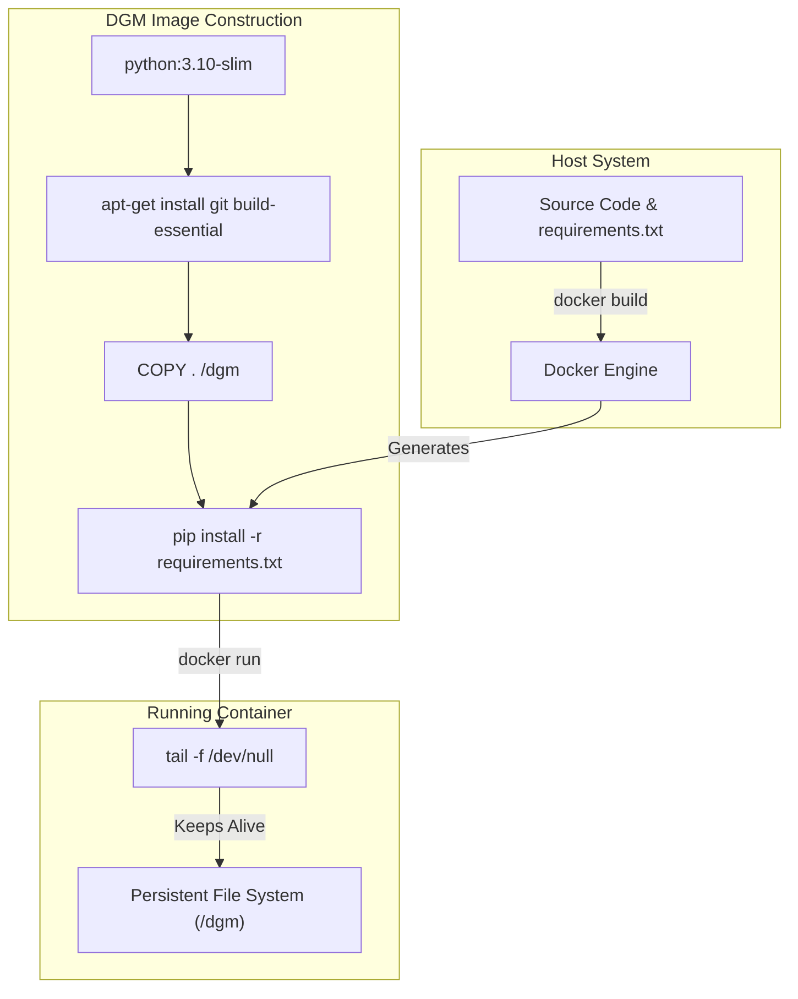
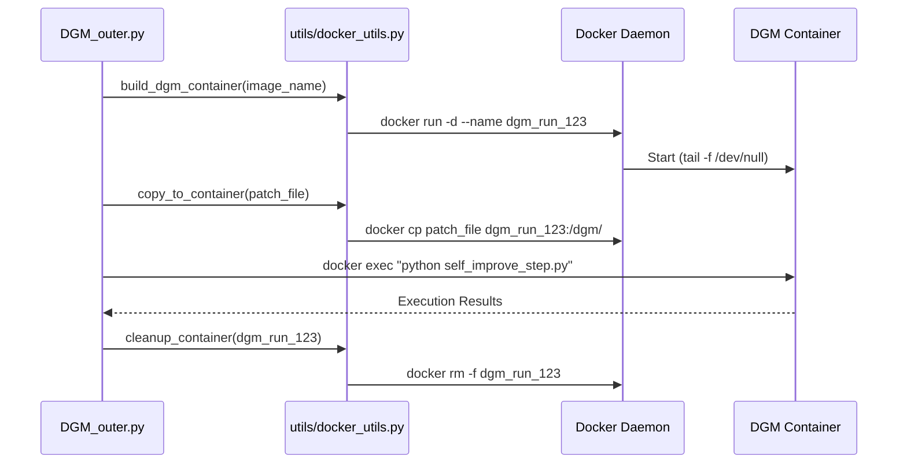

# Docker Infrastructure and Containerization

The Darwin Gödel Machine (DGM) relies heavily on Docker to provide isolated, reproducible, and persistent environments for both the evolutionary "Outer Loop" and the "Inner Agent" code execution. The infrastructure is designed to allow an agent to modify its own source code within a container, verify those changes, and then persist the results back to the host system.

## 1. The DGM Docker Image

The system uses a unified `Dockerfile` to create a standardized environment where the DGM logic and its dependencies reside.

### 1.1 Base Image and System Dependencies
The image is built on `python:3.10-slim` to minimize footprint while providing a modern Python environment [Dockerfile:2-2](https://github.com/hexo-ai/dgm/blob/main/Dockerfile#L2). To support compilation tasks and repository management, it installs `build-essential` and `git` via `apt-get` [Dockerfile:5-8](https://github.com/hexo-ai/dgm/blob/main/Dockerfile#L5-L8).

### 1.2 Environment Setup and Persistence
The container is configured with a working directory at `/dgm` [Dockerfile:11](https://github.com/hexo-ai/dgm/blob/main/Dockerfile). The entire repository is copied into this directory [Dockerfile:14](https://github.com/hexo-ai/dgm/blob/main/Dockerfile), and Python dependencies are installed from `requirements.txt` [Dockerfile:17](https://github.com/hexo-ai/dgm/blob/main/Dockerfile).

A critical aspect of the DGM infrastructure is the **Persistence Model**. By default, the container executes `tail -f /dev/null` [Dockerfile:20](https://github.com/hexo-ai/dgm/blob/main/Dockerfile). This prevents the container from exiting immediately after start, allowing the DGM orchestrator to:
1. Start the container once.
2. Execute multiple asynchronous commands (via `docker exec`).
3. Maintain state across different tool calls (e.g., file edits followed by test runs).

### 1.3 .dockerignore Strategy
To keep the build context small and prevent recursive image nesting, the `.dockerignore` file excludes large datasets, logs, and the Docker-related files themselves [.dockerignore:9-29](https://github.com/hexo-ai/dgm/blob/main/.dockerignore#L9-L29). Notably, it excludes the `swe_bench/` and `polyglot/` directories [.dockerignore:11-15](https://github.com/hexo-ai/dgm/blob/main/.dockerignore#L11-L15), as these benchmarks often manage their own specialized containers or large-scale data that should not be baked into the core DGM image.

**Diagram: Container Build and Persistence Flow**

Sources: [Dockerfile:1-20](https://github.com/hexo-ai/dgm/blob/main/Dockerfile#L1-L20), [.dockerignore:1-39](https://github.com/hexo-ai/dgm/blob/main/.dockerignore#L1-L39)

---

## 2. Container Lifecycle Management

Container orchestration is handled primarily through `utils/docker_utils.py`, which provides a thread-safe wrapper around the Docker CLI.

### 2.1 Building and Running
The function `build_dgm_container` [utils/docker_utils.py:16-43](https://github.com/hexo-ai/dgm/blob/main/utils/docker_utils.py#L16-L43) manages the creation of the container. It uses a unique container name (often involving a UUID or timestamp) to prevent collisions during parallel evolutionary runs. It mounts the local directory if necessary and ensures the container is running in detached mode (`-d`).

### 2.2 Command Execution
Execution inside the container is performed using `docker exec`. The `BashSession` class in the tools layer interacts with these running containers to provide the `coding_agent` with a functional shell.

### 2.3 Data Transfer and Cleanup
*   **copy_to_container**: Moves patches or configuration files from the host into the isolated environment [utils/docker_utils.py:64-77](https://github.com/hexo-ai/dgm/blob/main/utils/docker_utils.py#L64-L77).
*   **copy_from_container**: Retrieves generated logs, metadata, or modified source code from the container back to the host for archival [utils/docker_utils.py:79-92](https://github.com/hexo-ai/dgm/blob/main/utils/docker_utils.py#L79-L92).
*   **cleanup_container**: Ensures that containers are stopped and removed (`docker rm -f`) to prevent resource exhaustion on the host machine [utils/docker_utils.py:45-56](https://github.com/hexo-ai/dgm/blob/main/utils/docker_utils.py#L45-L56).

**Diagram: Orchestrator to Container Interaction**

Sources: [utils/docker_utils.py:16-92](https://github.com/hexo-ai/dgm/blob/main/utils/docker_utils.py#L16-L92)

---

## 3. Benchmark-Specific Infrastructure

While the core DGM uses the standard `Dockerfile`, the evaluation benchmarks (SWE-bench and Polyglot) implement specialized container logic.

### 3.1 SWE-bench Harness
In `swe_bench/harness.py`, the system manages a separate lifecycle for benchmark instances. It uses `get_docker_client` to interface with the Docker API directly [swe_bench/utils.py:21-28](https://github.com/hexo-ai/dgm/blob/main/swe_bench/utils.py#L21-L28). The harness builds environment-specific images for each repository (e.g., `django`, `scikit-learn`) to ensure the correct C-extensions and system libraries are present for testing.

### 3.2 Polyglot Evaluation
The Polyglot benchmark uses `polyglot/docker_build.py` to create images capable of compiling multiple languages (C++, Java, Python, etc.). It extends the base concepts by dynamically generating Dockerfiles or build commands based on the `test_spec` of the specific challenge [polyglot/harness.py:35-55](https://github.com/hexo-ai/dgm/blob/main/polyglot/harness.py#L35-L55).

**Table: Docker Utility Distribution**

| Module | Primary Responsibility | Key Entities |
| :--- | :--- | :--- |
| `utils/docker_utils.py` | General DGM lifecycle | `build_dgm_container`, `cleanup_container` |
| `swe_bench/utils.py` | SWE-bench specific isolation | `get_docker_client`, `exec_lib` |
| `polyglot/docker_utils.py` | Multi-language env management | `PolyglotDockerClient` |

Sources: [swe_bench/harness.py:10-40](https://github.com/hexo-ai/dgm/blob/main/swe_bench/harness.py#L10-L40), [polyglot/harness.py:35-55](https://github.com/hexo-ai/dgm/blob/main/polyglot/harness.py#L35-L55), [utils/docker_utils.py:1-100](https://github.com/hexo-ai/dgm/blob/main/utils/docker_utils.py#L1-L100)
