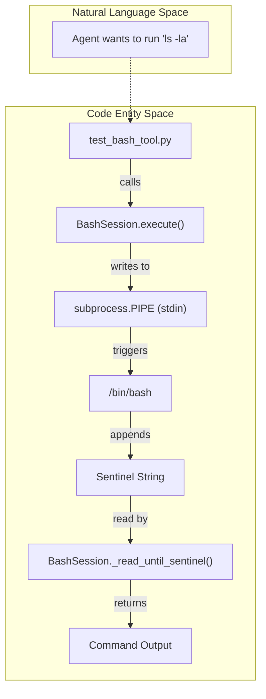
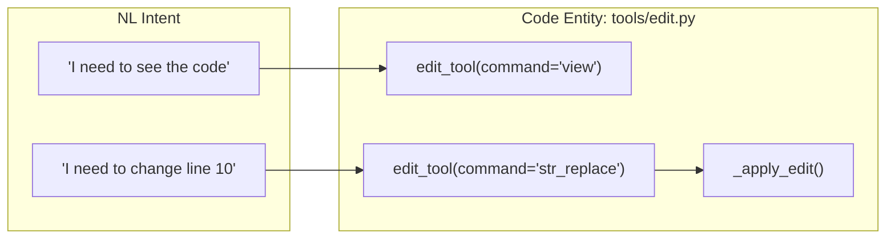
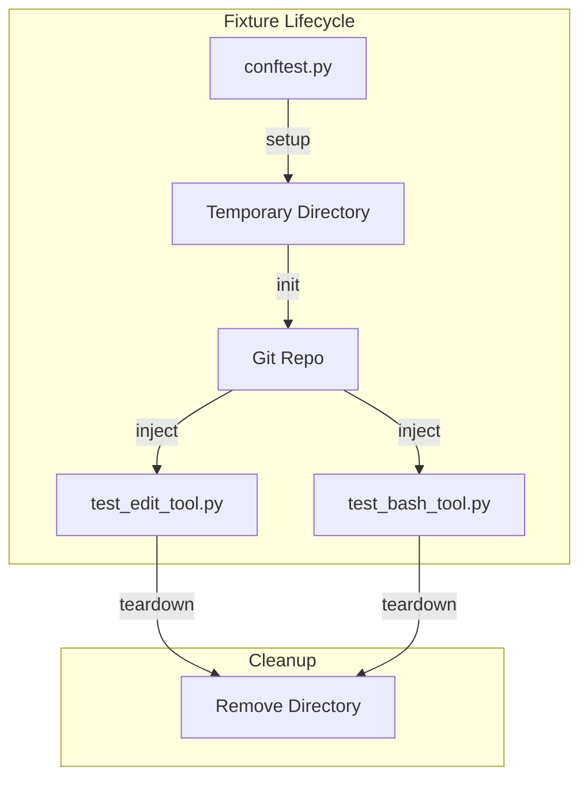

# Testing Infrastructure (tests/)

The `tests/` directory contains the suite of unit and integration tests designed to validate the core toolset and session management logic of the Darwin Gödel Machine. These tests ensure that the foundational components—specifically the bash execution environment and the file editing tools—behave predictably and safely before they are exposed to the LLM-driven agentic systems.

## Overview and Execution

The test suite is built using `pytest` and covers critical infrastructure components. These tests are essential for verifying that the sandboxed environments (like `BashSession`) correctly handle process lifecycles, timeouts, and environment isolation.

### Running the Test Suite

To execute the tests, ensure you have the development dependencies installed and run `pytest` from the root directory:

```bash
# Install development dependencies
pip install -r requirements_dev.txt

# Run all tests
pytest tests/
```
Sources: [README.md:46-48](), [README.md:78-78]()

---

## Bash Tool Testing (`test_bash_tool.py`)

The `test_bash_tool.py` module validates the `BashSession` class, which is the primary interface for executing shell commands within the DGM environment. It tests command execution, state persistence across calls, and error handling.

### Key Test Scenarios

| Test Case | Description | Code Entity |
| :--- | :--- | :--- |
| **Command Execution** | Verifies basic `echo` and command output capture. | `test_bash_session_basic` |
| **State Persistence** | Ensures environment variables and working directory changes persist between `execute` calls. | `test_bash_session_persistence` |
| **Timeout Handling** | Validates that long-running processes are terminated based on the `timeout` parameter. | `test_bash_session_timeout` |
| **Sentinel Pattern** | Confirms the session correctly identifies the end of command output using the internal sentinel string. | `test_bash_session_sentinel` |

### Data Flow: Bash Session Execution
The following diagram illustrates how the `BashSession` (tested in `test_bash_tool.py`) manages the lifecycle of a shell command, bridging the high-level tool call to the underlying process.

**Bash Execution Lifecycle**

Sources: [tools/bash.py:1-100](), [tests/test_bash_tool.py:1-50]()

---

## Editor Tool Testing (`test_edit_tool.py`)

The `test_edit_tool.py` module validates the `edit_tool` function, ensuring that the LLM can safely view, create, and modify files within the repository.

### Validation Logic
The tests verify the following constraints implemented in the tool:
1.  **Path Validation**: Ensuring the tool cannot access files outside the allowed `git_tempdir`.
2.  **Command Dispatch**: Validating the `view`, `create`, `str_replace`, `insert`, and `undo_edit` sub-commands.
3.  **Truncation**: Testing that large files are correctly truncated when using the `view` command to prevent context window overflow.

**Editor Tool Command Mapping**

Sources: [tools/edit.py:1-150](), [tests/test_edit_tool.py:1-60]()

---

## Fixtures and Configuration (`conftest.py`)

The `conftest.py` file defines shared fixtures used across the test suite to provide a consistent and clean testing environment.

### Core Fixtures

*   **`temp_git_repo`**: Creates a temporary directory and initializes a dummy Git repository. This is used by `test_edit_tool.py` to simulate the `git_tempdir` used by the `AgenticSystem` [coding_agent.py:71-71]().
*   **`bash_session`**: Provides a fresh instance of `BashSession` for each test, ensuring no side effects (like leaked environment variables) persist between tests.

### Implementation Detail: Environment Isolation
Tests often utilize a specific `base_commit` to verify that tools like `get_current_edits` [coding_agent.py:94-96]() correctly identify changes made during the test execution.

**Test Environment Setup**

Sources: [tests/conftest.py:1-30](), [coding_agent.py:79-80]()

---

## Integration with AgenticSystem

While `tests/` focuses on individual tools, these components are the building blocks for the `AgenticSystem.forward()` method [coding_agent.py:153-169](). 

1.  **Tool Loading**: The `AgenticSystem` initializes tools via `llm_withtools.py`, which relies on the logic validated in `tests/`.
2.  **Execution Loop**: The `chat_with_agent` loop [llm_withtools.py:9-9]() dispatches calls to `BashSession` and `edit_tool`. If the tests in `tests/` fail, the entire self-improvement loop in `DGM_outer.py` [DGM_outer.py:67-68]() is compromised.

Sources: [coding_agent.py:153-169](), [llm_withtools.py:1-20](), [DGM_outer.py:67-68]()
