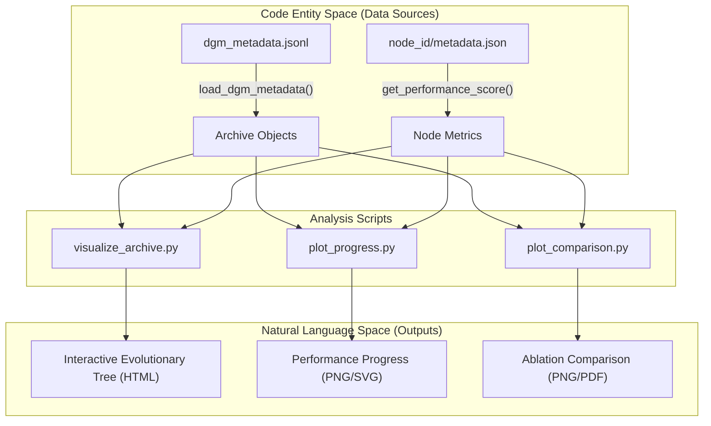

# Analysis and Visualization (analysis/)

The `analysis/` directory provides a suite of tools for post-run evaluation, performance tracking, and lineage visualization of the Darwin Gödel Machine (DGM) evolutionary process. These scripts interface with the `dgm_metadata.jsonl` files generated by the outer loop to reconstruct the evolutionary tree and compare different experimental runs.

### Overview of Analysis Tools

The toolkit consists of three primary scripts, each serving a distinct role in the research and development lifecycle:

| Script | Primary Purpose | Key Output |
| :--- | :--- | :--- |
| `visualize_archive.py` | Interactive tree visualization of the entire evolutionary archive. | Interactive Plotly HTML |
| `plot_progress.py` | Time-series tracking of a single run's performance over iterations. | PNG/SVG Plots |
| `plot_comparison.py` | Comparative analysis between DGM and various ablation baselines. | PNG/PDF Plots |

### Core Data Pipeline
All analysis scripts rely on the `load_dgm_metadata` function from `utils.evo_utils` to ingest the history of the run [analysis/plot_comparison.py:12-12](https://github.com/hexo-ai/dgm/blob/main/analysis/plot_comparison.py#L12). They utilize `metadata.json` files stored within individual node directories to extract performance metrics and parentage information [analysis/visualize_archive.py:35-41](https://github.com/hexo-ai/dgm/blob/main/analysis/visualize_archive.py#L35-L41).

The following diagram illustrates how the analysis scripts bridge the gap between the raw execution data (JSONL/Metadata) and human-readable visualizations.

**Data Flow: From Code Execution to Visualization**

Sources: [analysis/visualize_archive.py:8-14](https://github.com/hexo-ai/dgm/blob/main/analysis/visualize_archive.py#L8-L14), [analysis/plot_progress.py:5-7](https://github.com/hexo-ai/dgm/blob/main/analysis/plot_progress.py#L5-L7), [analysis/plot_comparison.py:6-7](https://github.com/hexo-ai/dgm/blob/main/analysis/plot_comparison.py#L6-L7)

---

### [Archive Visualization (visualize_archive.py)](06.1-archive-visualization.md)
This script generates an interactive Directed Acyclic Graph (DAG) using `networkx` and `plotly`. It visualizes the "Lineage" of the agents, showing which parent produced which child and how scores evolved across the archive.

*   **Key Functionality**: Uses `nx.nx_agraph.graphviz_layout` with the `dot` program to organize the tree [analysis/visualize_archive.py:161-163](https://github.com/hexo-ai/dgm/blob/main/analysis/visualize_archive.py#L161-L163).
*   **Metrics**: Supports both standard accuracy scoring via `get_performance_score` and hallucination-specific scoring via `get_hallucination_score` [analysis/visualize_archive.py:56-90](https://github.com/hexo-ai/dgm/blob/main/analysis/visualize_archive.py#L56-L90).
*   **Eval Tiers**: Categorizes nodes into `SMALL`, `MED`, or `BIG` using the `EvalQuantity` enum based on the number of instances evaluated [analysis/visualize_archive.py:11-30](https://github.com/hexo-ai/dgm/blob/main/analysis/visualize_archive.py#L11-L30).

For details, see [Archive Visualization (visualize_archive.py)](06.1-archive-visualization.md).

### [Progress Plotting (plot_progress.py)](06.2-progress-plotting.md)
This utility focuses on the temporal progression of a single experiment. It tracks how the archive's average and best scores improve over successive iterations.

*   **Lineage Tracking**: It identifies the "Lineage to Final Best Agent" by backtracing from the highest-scoring node to the `initial` root using `get_parent_commit` [analysis/plot_progress.py:58-65](https://github.com/hexo-ai/dgm/blob/main/analysis/plot_progress.py#L58-L65).
*   **Visualization**: Generates plots comparing the "Average of Archive" against the "Best Agent" [analysis/plot_progress.py:79-82](https://github.com/hexo-ai/dgm/blob/main/analysis/plot_progress.py#L79-L82).

For details, see [Progress Plotting (plot_progress.py)](06.2-progress-plotting.md).

### [Ablation Comparison Plotting (plot_comparison.py)](06.3-ablation-comparison-plotting.md)
This script is used for scientific validation, comparing the standard DGM run against baseline configurations such as `no_darwin`, `no_selfimprove`, and `greedy`.

*   **Comparison Logic**: It aggregates data from multiple run directories and aligns them by iteration [analysis/plot_comparison.py:115-147](https://github.com/hexo-ai/dgm/blob/main/analysis/plot_comparison.py#L115-L147).
*   **SOTA Benchmarking**: Includes a reference line for "Checked Open-sourced SoTA" (State of the Art) to provide context for the results [analysis/plot_comparison.py:61-64](https://github.com/hexo-ai/dgm/blob/main/analysis/plot_comparison.py#L61-L64).
*   **Metrics**: Produces separate plots for `best`, `avg`, and `total` scores across all compared runs [analysis/plot_comparison.py:148-151](https://github.com/hexo-ai/dgm/blob/main/analysis/plot_comparison.py#L148-L151).

For details, see [Ablation Comparison Plotting (plot_comparison.py)](06.3-ablation-comparison-plotting.md).

---

**System Mapping: Analysis Logic to Code**
```mermaid
classDiagram
    class AnalysisScripts {
        <<Module>>
        visualize_archive.py
        plot_progress.py
        plot_comparison.py
    }

    class DataParsing {
        get_performance_score()
        get_parent_commit()
        get_run_info()
    }

    class Visualization {
        create_plotly_figure()
        make_plot()
        EvalQuantity
    }

    AnalysisScripts ..> DataParsing : uses
    AnalysisScripts ..> Visualization : triggers
    DataParsing ..> "utils/evo_utils.py" : calls load_dgm_metadata()
```
Sources: [analysis/visualize_archive.py:11-14](https://github.com/hexo-ai/dgm/blob/main/analysis/visualize_archive.py#L11-L14), [analysis/plot_progress.py:5-6](https://github.com/hexo-ai/dgm/blob/main/analysis/plot_progress.py#L5-L6), [analysis/plot_comparison.py:10-12](https://github.com/hexo-ai/dgm/blob/main/analysis/plot_comparison.py#L10-L12)
