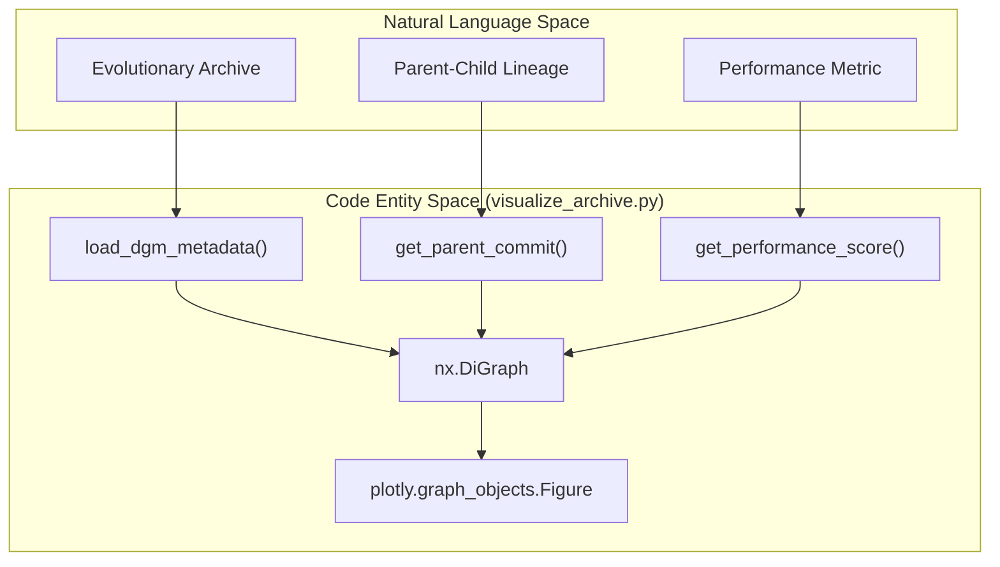
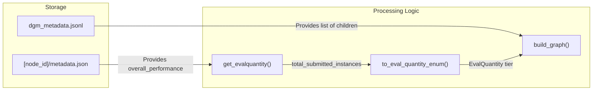

# Archive Visualization (visualize_archive.py)

The `visualize_archive.py` script provides a suite of tools for analyzing and visualizing the evolutionary trajectory of a Darwin Gödel Machine (DGM) experiment. It processes the `dgm_metadata.jsonl` archive to construct a directed graph (DiGraph) representing the lineage of self-improved agentic systems, highlighting performance gains, compilation success, and evaluation depth through interactive Plotly HTML outputs.

## Core Logic and Data Flow

The script operates by reading the experiment directory and parsing metadata for each node (commit) in the archive. It transforms the linear log of mutations into a hierarchical tree structure using `networkx`.

### DiGraph Construction
The function `build_graph` [analysis/visualize_archive.py:92-163]() is the primary engine for graph assembly. It performs the following steps:
1.  **Root Initialization**: Creates an "initial" node representing the baseline agent [analysis/visualize_archive.py:101-128]().
2.  **Edge Mapping**: Iterates through the `archives` list (loaded from `dgm_metadata.jsonl`), identifying parent-child relationships via the `parent_commit` metadata field [analysis/visualize_archive.py:131-159]().
3.  **Attribute Assignment**: Each node is decorated with metadata including its `run_id`, whether it successfully `compiled`, its `score` (accuracy or hallucination), and its `eval_quantity` [analysis/visualize_archive.py:150-158]().
4.  **Layout**: Uses the Graphviz `dot` engine via `nx.nx_agraph.graphviz_layout` to produce a hierarchical top-down layout [analysis/visualize_archive.py:162]().

### EvalQuantity and Scoring Modes
The system categorizes evaluation runs into three tiers based on the number of instances tested, defined by the `EvalQuantity` enum [analysis/visualize_archive.py:11-14]().

| Tier | Accuracy Mode (Instances) | Hallucination Mode (Score Range) |
| :--- | :--- | :--- |
| **SMALL** | $\le 10$ | $\le 1.5$ |
| **MED** | $11 - 60$ | N/A |
| **BIG** | $> 60$ | $> 1.5$ |

*   **Accuracy Scoring**: Uses `get_performance_score` [analysis/visualize_archive.py:56-68]() to extract the `accuracy_score` from `overall_performance`.
*   **Hallucination Scoring**: Uses `get_hallucination_score` [analysis/visualize_archive.py:70-89](). This metric combines `solved_halluc_score` (binary) with `percent_toolutilized` (0.0 to 1.0) to provide a more granular range of $[0, 2]$.

**Sources:** [analysis/visualize_archive.py:11-89](), [analysis/visualize_archive.py:92-163]()

## System Entity Mapping

The following diagram bridges the high-level evolutionary concepts to the specific code entities and data structures used in the visualization pipeline.

### Archive to Graph Mapping
"The visualization script maps JSONL metadata entries to NetworkX Graph nodes."


**Sources:** [analysis/visualize_archive.py:8-92](), [utils/evo_utils.py:8-8]()

### Metadata Extraction Flow
"How `visualize_archive.py` interacts with the file system and `dgm_metadata.jsonl`."


**Sources:** [analysis/visualize_archive.py:31-42](), [analysis/visualize_archive.py:92-163]()

## Interactive Visualization (Plotly)

The `create_plotly_figure` function [analysis/visualize_archive.py:166-175]() generates an interactive HTML file. Key features include:

*   **Lineage Highlighting**: The script automatically identifies the "best" node (highest score) and traces its lineage back to the "initial" root. This path is rendered with thicker edges to visualize the successful evolutionary branch.
*   **Visual Encoding**:
    *   **Node Color**: Represents the performance score (mapped to a color scale).
    *   **Node Shape**: Indicates the `EvalQuantity` (e.g., Circle for SMALL, Diamond for MED, Square for BIG).
    *   **Node Border**: Solid borders for nodes that `compiled` successfully; dashed or transparent for those that failed.
*   **Hover Data**: Displays the `run_id`, `score`, and compilation status.

**Sources:** [analysis/visualize_archive.py:166-175]()

## Experiment Analysis and Command Generation

The function `analyse_experiment_run()` [analysis/visualize_archive.py:237-331]() serves as a bridge between visualization and further evaluation. It performs the following:

1.  **Top-K Selection**: Identifies the top $N$ best-performing unique patches from the archive [analysis/visualize_archive.py:265-283]().
2.  **Command Generation**: For each top-performing node, it generates a shell command to run a full SWE-bench evaluation using `test_swebench.py` [analysis/visualize_archive.py:304-323]().
3.  **Output**: Prints a summary table of the best runs and the corresponding commands to standard output.

### Command Format Example
The generated commands follow this structure:
`python test_swebench.py --path [DGM_DIR] --run_id [NODE_ID] --eval_quantity big --eval_set [SET]`

**Sources:** [analysis/visualize_archive.py:237-331]()

## CLI Usage

The script is typically invoked from the command line with arguments to specify the experiment directory and scoring mode.

```bash
# Visualize accuracy scores for a SWE-bench run
python analysis/visualize_archive.py --path outputs/my_experiment --mode accuracy

# Visualize hallucination scores for a polyglot run
python analysis/visualize_archive.py --path outputs/my_polyglot_run --mode hallucination
```

### Arguments
*   `--path`: Path to the DGM output directory containing `dgm_metadata.jsonl`.
*   `--mode`: Choice of `accuracy` or `hallucination` scoring logic.
*   `--metadata_name`: (Optional) Defaults to `metadata.json`.

**Sources:** [analysis/visualize_archive.py:334-345]()
