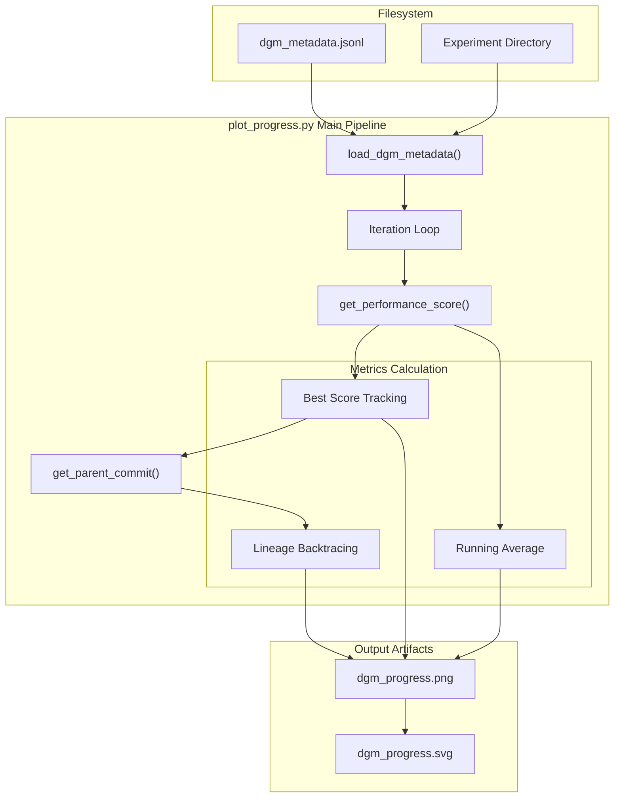

# Progress Plotting (plot_progress.py)

The `plot_progress.py` script is a visualization utility used to track the performance evolution of the Darwin Gödel Machine (DGM) over time. It generates static plots that illustrate how the archive's best and average scores improve across iterations and highlights the specific evolutionary lineage that led to the final best-performing agent.

## CLI Arguments and Configuration

The script is executed via the command line and accepts parameters to locate the experiment data and customize the visual output.

| Argument | Type | Description |
| :--- | :--- | :--- |
| `--path` | `str` | **Required.** The filesystem path to the DGM run directory containing `dgm_metadata.jsonl`. |
| `--color` | `str` | **Optional.** Color scheme for the plot lines. Options: `blue`, `green`, `orange` (default). |

### Color Schemes
The script defines specific hex codes for different visual styles to ensure clarity between the "Best Agent," "Average," and "Lineage" lines:
*   **Blue**: `['#4285F4', '#42d6f5', '#122240']` [analysis/plot_progress.py:73-73](https://github.com/hexo-ai/dgm/blob/main/analysis/plot_progress.py#L73)
*   **Green**: `['#0F9D58', '#9e9c10', '#042A17']` [analysis/plot_progress.py:74-74](https://github.com/hexo-ai/dgm/blob/main/analysis/plot_progress.py#L74)
*   **Orange**: `['#FF9C03', '#f56a00', '#533302']` [analysis/plot_progress.py:75-75](https://github.com/hexo-ai/dgm/blob/main/analysis/plot_progress.py#L75)

**Sources:**
* [analysis/plot_progress.py:10-13](https://github.com/hexo-ai/dgm/blob/main/analysis/plot_progress.py#L10-L13)
* [analysis/plot_progress.py:72-77](https://github.com/hexo-ai/dgm/blob/main/analysis/plot_progress.py#L72-L77)

## Data Processing Pipeline

The `main()` function implements a pipeline that transforms raw JSONL metadata into a time-series format suitable for plotting.

### 1. Metadata Loading and Initialization
The process begins by loading the evolutionary history using `load_dgm_metadata` [analysis/plot_progress.py:18](https://github.com/hexo-ai/dgm/blob/main/analysis/plot_progress.py). It initializes the plot with the "initial" root node (the baseline agent) and retrieves its performance score using `get_performance_score` [analysis/plot_progress.py:29](https://github.com/hexo-ai/dgm/blob/main/analysis/plot_progress.py).

### 2. Score Tracking Logic
The script iterates through the `archives` list, which contains the children produced at each evolutionary step. It maintains three primary metrics:
*   **Best Score**: The maximum score encountered up to the current iteration [analysis/plot_progress.py:46-47](https://github.com/hexo-ai/dgm/blob/main/analysis/plot_progress.py#L46-L47).
*   **Average Score**: A running average of scores in the archive. If a node is in `children_compiled` (meaning it successfully passed the compilation/build phase), its score is factored into the mean [analysis/plot_progress.py:49-51](https://github.com/hexo-ai/dgm/blob/main/analysis/plot_progress.py#L49-L51).
*   **Iteration Mapping**: A dictionary `it_nodeid_dict` maps the integer iteration count to the specific Git commit `node_id` [analysis/plot_progress.py:40](https://github.com/hexo-ai/dgm/blob/main/analysis/plot_progress.py).

### 3. Lineage Backtracing
Once the final "Best Agent" is identified, the script performs a backtracing operation to find its ancestors:
1.  It starts at the `best_node_id` [analysis/plot_progress.py:60](https://github.com/hexo-ai/dgm/blob/main/analysis/plot_progress.py).
2.  It recursively calls `get_parent_commit` to move up the tree until it reaches the "initial" node [analysis/plot_progress.py:61-64](https://github.com/hexo-ai/dgm/blob/main/analysis/plot_progress.py#L61-L64).
3.  The resulting list of commit IDs is reversed to show the path from the root to the best agent [analysis/plot_progress.py:65](https://github.com/hexo-ai/dgm/blob/main/analysis/plot_progress.py).

**Sources:**
* [analysis/plot_progress.py:9-67](https://github.com/hexo-ai/dgm/blob/main/analysis/plot_progress.py#L9-L67)
* [analysis/visualize_archive.py:5-5](https://github.com/hexo-ai/dgm/blob/main/analysis/visualize_archive.py#L5) (Imports `get_parent_commit`, `get_performance_score`)
* [utils/evo_utils.py:6-6](https://github.com/hexo-ai/dgm/blob/main/utils/evo_utils.py#L6) (Imports `load_dgm_metadata`)

## Data Flow Diagram

The following diagram illustrates the flow of data from the experiment directory through the processing functions to the final visualization files.

### DGM Progress Data Flow

**Sources:**
* [analysis/plot_progress.py:18-96](https://github.com/hexo-ai/dgm/blob/main/analysis/plot_progress.py#L18-L96)
* [analysis/visualize_archive.py:5-5](https://github.com/hexo-ai/dgm/blob/main/analysis/visualize_archive.py#L5)

## Output and Visualization

The script generates two files in the experiment directory specified by `--path`:
1.  `dgm_progress.png`: A standard raster image for quick viewing [analysis/plot_progress.py:93](https://github.com/hexo-ai/dgm/blob/main/analysis/plot_progress.py).
2.  `dgm_progress.svg`: A vector graphic with a transparent background, suitable for high-quality documentation or presentations [analysis/plot_progress.py:95](https://github.com/hexo-ai/dgm/blob/main/analysis/plot_progress.py).

### Plot Components
The resulting plot contains three distinct visual elements:
*   **Average of Archive**: Represents the overall health/improvement of the entire population of agents [analysis/plot_progress.py:80](https://github.com/hexo-ai/dgm/blob/main/analysis/plot_progress.py).
*   **Best Agent**: A step-function-like line showing the maximum performance reached at any point in time [analysis/plot_progress.py:81](https://github.com/hexo-ai/dgm/blob/main/analysis/plot_progress.py).
*   **Lineage to Final Best Agent**: A series of points highlighting the specific "winning" evolutionary path, allowing developers to see which intermediate mutations were successful [analysis/plot_progress.py:82](https://github.com/hexo-ai/dgm/blob/main/analysis/plot_progress.py).

### Logic Mapping: Code to Visuals
The relationship between the internal tracking variables and the visual output is defined as follows:

| Code Entity | Plot Representation | Calculation Logic |
| :--- | :--- | :--- |
| `avg_scores` | `Average of Archive` | `(prev_avg * count + new_score) / (count + 1)` [analysis/plot_progress.py:50-51](https://github.com/hexo-ai/dgm/blob/main/analysis/plot_progress.py#L50-L51) |
| `best_scores` | `Best Agent` | `max(new_score, best_scores[-1])` [analysis/plot_progress.py:46-47](https://github.com/hexo-ai/dgm/blob/main/analysis/plot_progress.py#L46-L47) |
| `best_node_progress_scores` | `Lineage to Final Best Agent` | Performance of commits returned by `get_parent_commit` [analysis/plot_progress.py:63-67](https://github.com/hexo-ai/dgm/blob/main/analysis/plot_progress.py#L63-L67) |

**Sources:**
* [analysis/plot_progress.py:80-96](https://github.com/hexo-ai/dgm/blob/main/analysis/plot_progress.py#L80-L96)
* [analysis/plot_progress.py:50-53](https://github.com/hexo-ai/dgm/blob/main/analysis/plot_progress.py#L50-L53)
* [analysis/plot_progress.py:63-67](https://github.com/hexo-ai/dgm/blob/main/analysis/plot_progress.py#L63-L67)
