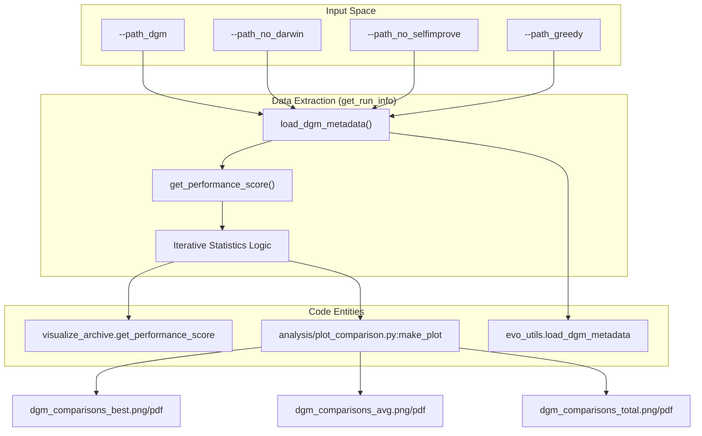
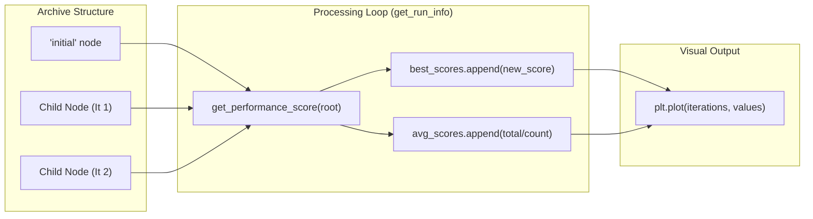

# Ablation Comparison Plotting (plot_comparison.py)

The `analysis/plot_comparison.py` script is a specialized visualization tool used to compare the performance of the full Darwin Gödel Machine (DGM) against various ablation baselines. It processes metadata from multiple experiment runs to generate comparative plots for the best agent score, average scores, and total cumulative scores over evolutionary iterations.

## Overview and Purpose

The primary goal of `plot_comparison.py` is to quantify the impact of specific DGM components—such as the open-ended exploration (Darwinian selection) and the self-improvement mutation step—by plotting their performance trajectories on the same axes. It allows researchers to visualize how different configurations (e.g., Greedy selection vs. Darwinian selection) scale as the number of iterations increases [analysis/plot_comparison.py:115-122]().

### Key Metrics Tracked
*   **Best Score**: The highest SWE-bench score achieved by any agent in the archive up to that iteration [analysis/plot_comparison.py:42-43]().
*   **Average Score**: The running average of performance across compiled agents [analysis/plot_comparison.py:44-47]().
*   **Total Score**: The cumulative performance score across all iterations [analysis/plot_comparison.py:50-51]().

## CLI Arguments and Configuration

The script uses `argparse` to accept paths to different experiment directories. Each path represents a specific ablation or the full DGM run.

| Argument | Type | Description |
| :--- | :--- | :--- |
| `--path_dgm` | `str` | Path to the directory containing the full DGM run results [analysis/plot_comparison.py:117](). |
| `--path_no_selfimprove` | `str` | Path to the baseline run where the self-improvement mutation was disabled [analysis/plot_comparison.py:118](). |
| `--path_no_darwin` | `str` | Path to the baseline run without open-ended exploration/selection logic [analysis/plot_comparison.py:119](). |
| `--path_greedy` | `str` | Path to the baseline run using a greedy selection strategy [analysis/plot_comparison.py:120](). |
| `--all_its` | `bool` | If set, plots all iterations for every run. If false (default), clips all runs to the length of the shortest run for fair comparison [analysis/plot_comparison.py:121](). |

**Sources:** [analysis/plot_comparison.py:115-122]()

## Data Pipeline and Processing

The script follows a structured pipeline: loading metadata, calculating iterative statistics, and generating visualizations.

### 1. Data Extraction (`get_run_info`)
The `get_run_info()` function serves as the data ingestion engine. It loads the `dgm_metadata.jsonl` file and iterates through the evolutionary history to build a step-by-step performance record.

*   **Initialization**: It starts by loading the "initial" (baseline) performance score [analysis/plot_comparison.py:23-28]().
*   **Iteration Logic**: For every entry in the metadata, it identifies child nodes and retrieves their performance using `get_performance_score()` from the `visualize_archive` module [analysis/plot_comparison.py:33-37]().
*   **Average Calculation**: The average score is updated only when a node is found in the `children_compiled` list, ensuring that only successfully built agents contribute to the mean [analysis/plot_comparison.py:45-47]().

### 2. Visualization Logic (`make_plot`)
The `make_plot()` function handles the rendering of the comparison graphs using `matplotlib`.

*   **SOTA Reference**: For "best" score plots, the script draws a horizontal dashed line at `0.51` representing the "Checked Open-sourced SoTA" for SWE-bench [analysis/plot_comparison.py:62-64]().
*   **Color Mapping**: It applies a consistent color scheme to differentiate the runs:
    *   **DGM**: Blue (`#4285F4`)
    *   **DGM w/o Open-ended exploration**: Yellow (`#F4B400`)
    *   **DGM w/o Self-improve**: Green (`#0F9D58`)
    *   **DGM Greedy**: Purple (`#673AB7`) [analysis/plot_comparison.py:67-72]().
*   **Output**: Plots are saved in both PNG (standard) and PDF (transparent background for publications) formats within the `./analysis/output/` directory [analysis/plot_comparison.py:104-111]().

### Data Flow Diagram

The following diagram illustrates how the script transforms raw experiment metadata into comparison plots.

"Plot Comparison Data Flow"

**Sources:** [analysis/plot_comparison.py:10-58](), [analysis/plot_comparison.py:60-113](), [analysis/plot_comparison.py:125-151]()

## Logic Mapping: Iteration to Performance

The script maps the hierarchical nature of the DGM archive into a linear sequence of "Iterations" for plotting purposes.

"Iteration Logic Mapping"

**Sources:** [analysis/plot_comparison.py:30-51](), [analysis/plot_comparison.py:81-88]()

## Implementation Details

### Handling Iteration Lengths
By default, the script ensures a fair comparison by clipping all runs to the length of the shortest experiment in the set (`min_length`). This prevents a longer-running experiment from appearing superior simply due to more opportunities for improvement [analysis/plot_comparison.py:74-75](). This behavior can be overridden with the `--all_its` flag [analysis/plot_comparison.py:121]().

### File Exports
The script automatically creates the `./analysis/output/` directory if it does not exist [analysis/plot_comparison.py:105-106](). It generates three sets of files:
1.  `dgm_comparisons_best`: Visualizes the peak performance found in the archive [analysis/plot_comparison.py:149]().
2.  `dgm_comparisons_avg`: Visualizes the stability and general quality of the evolved agents [analysis/plot_comparison.py:150]().
3.  `dgm_comparisons_total`: Visualizes the cumulative success over the run [analysis/plot_comparison.py:151]().

**Sources:** [analysis/plot_comparison.py:74-88](), [analysis/plot_comparison.py:104-112](), [analysis/plot_comparison.py:148-151]()
