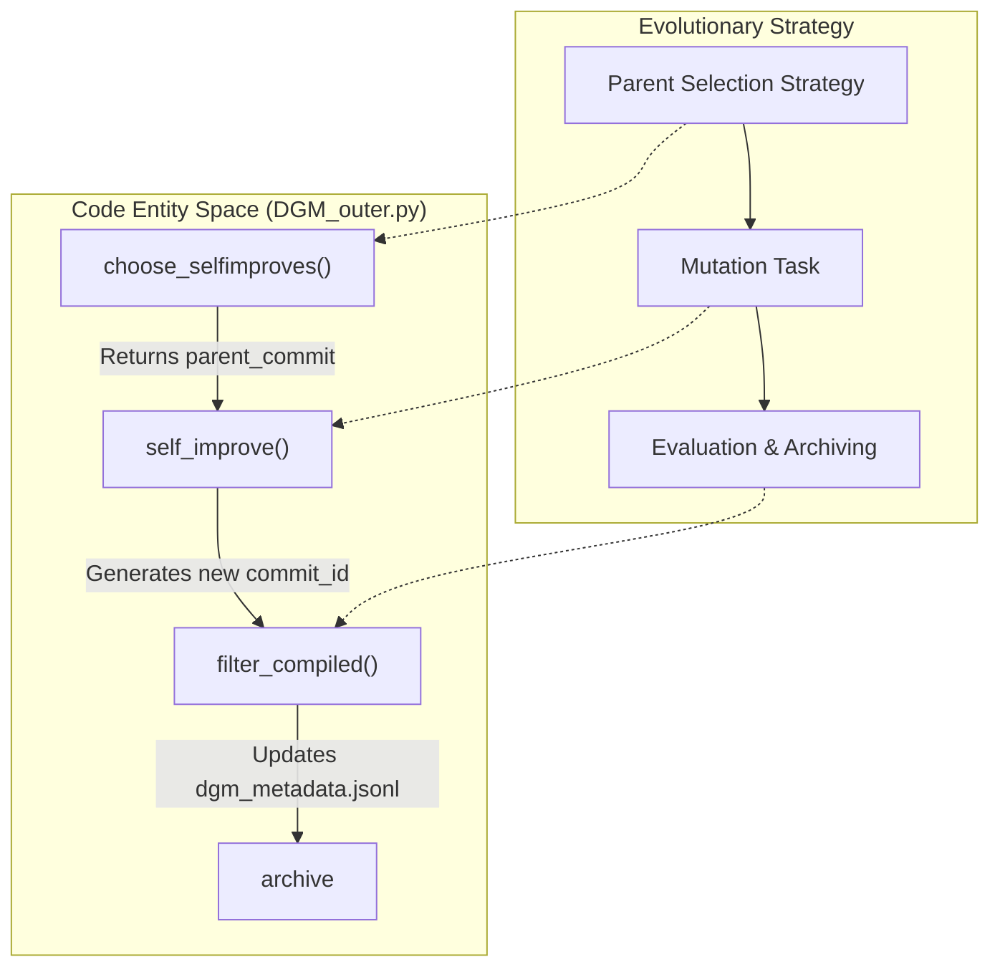
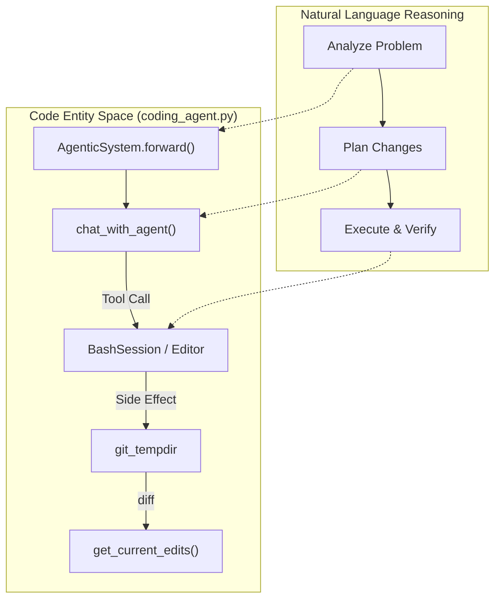

# Glossary — Key Terms, Jargon, and Code Pointers

This page defines the technical vocabulary, domain-specific jargon, and architectural concepts used within the Darwin Gödel Machine (DGM) codebase. It serves as a reference for onboarding engineers to map conceptual terms to their concrete implementations.

## Core Evolutionary Concepts

The DGM operates as an open-ended evolutionary system where the "individuals" are versions of the codebase itself.

| Term | Definition | Code Pointer |
| :--- | :--- | :--- |
| **Archive** | The set of all discovered code versions (commits) that are eligible to be parents for the next generation. | `archive` variable in [DGM_outer.py:19-24]() |
| **Generation** | A single iteration of the outer loop where multiple self-improvement attempts are launched in parallel. | `start_gen_num` in [DGM_outer.py:17-25]() |
| **Parent Selection** | The strategy used to pick which existing code version to mutate. Strategies include `score_prop`, `score_child_prop`, and `best`. | `choose_selfimproves` in [DGM_outer.py:50-150]() |
| **Self-Improvement Step** | The process of an agent diagnosing its own failures and applying a patch to its own source code. | `self_improve` in [self_improve_step.py:10-10]() |
| **Mutation** | A code change (diff) generated by the LLM during a self-improvement step to fix a bug or improve performance. | `apply_patch` in [utils/git_utils.py:11-11]() |

**Sources:** [DGM_outer.py:15-150](), [self_improve_step.py:10-10](), [utils/git_utils.py:11-11]()

## Agentic System Components

The "Inner Loop" consists of an agent capable of using tools to interact with a repository.

### AgenticSystem
The primary class implementing the coding agent. It manages the conversation history, tool invocations, and the target repository state.
*   **Implementation:** [coding_agent.py:67-170]()
*   **Forward Method:** The entry point for the agent to begin solving a task. [coding_agent.py:153-169]()
*   **Thread-Local Logging:** Uses `threading.local()` to ensure that parallel agent runs do not mix their log outputs. [coding_agent.py:13-27]()

### Tools
Functions provided to the LLM to interact with the environment.
*   **BashSession:** Manages a persistent shell for executing commands and running tests.
*   **Editor:** Allows the agent to view, create, and edit files using specific commands like `view`, `create`, `str_replace`, and `undo_edit`.

**Sources:** [coding_agent.py:13-170]()

## Technical Jargon & Abbreviations

| Term | Meaning | Context |
| :--- | :--- | :--- |
| **SWE-bench** | Software Engineering Benchmark used to evaluate the agent's ability to fix real-world GitHub issues. | [README.md:52-58]() |
| **Polyglot** | A benchmark variant testing the agent across multiple programming languages (C++, Java, etc.). | [DGM_outer.py:28-35](), [README.md:60-63]() |
| **Empty Patch** | A submission where the agent failed to produce any code changes, often filtered out of the archive. | `total_emptypatch_ids` in [DGM_outer.py:65-65]() |
| **Compiled Run** | A code version that successfully passed the "shallow" evaluation (e.g., it didn't crash during basic tests). | `filter_compiled` in [DGM_outer.py:152-160]() |
| **Lineage** | The ancestral path from the `initial` code version to a specific child commit. | `get_parent_commit` in [analysis/visualize_archive.py:44-53]() |

**Sources:** [DGM_outer.py:28-160](), [README.md:52-63](), [analysis/visualize_archive.py:44-53]()

## Data Flow: Natural Language to Code Entity Space

The following diagrams bridge high-level evolutionary concepts to the specific Python classes and functions that implement them.

### Diagram 1: Evolutionary Loop Orchestration
This diagram shows how the conceptual "Evolutionary Loop" is mapped to the `DGM_outer.py` orchestration logic.

**Sources:** [DGM_outer.py:50-160](), [self_improve_step.py:10-10]()

### Diagram 2: Inner Agent Execution Flow
This diagram maps the "Agentic Reasoning" process to the `AgenticSystem` implementation and its tool dependencies.

**Sources:** [coding_agent.py:67-169](), [llm_withtools.py:9-9]()

## Metrics and Scoring

The system uses several metrics to rank the "fitness" of code versions.

*   **Accuracy Score:** The percentage of benchmark instances resolved by a specific version of the agent. [analysis/visualize_archive.py:56-68]()
*   **Hallucination Score:** A metric ranging from [0, 2] that penalizes agents for hallucinating information while rewarding efficient tool usage. [analysis/visualize_archive.py:70-89]()
*   **EvalQuantity:** A categorization of the evaluation scale (`SMALL`, `MED`, `BIG`) based on the number of instances tested. [analysis/visualize_archive.py:11-29]()

**Sources:** [analysis/visualize_archive.py:11-89]()

## Infrastructure Pointers

*   **Metadata Persistence:** The global state of the experiment is stored in `dgm_metadata.jsonl`. [DGM_outer.py:22-24]()
*   **Containerization:** The system relies on Docker to isolate evaluations and the self-improvement environment. [README.md:32-38]()
*   **Logging:** Every agent interaction is captured in `chat_history.md` (or similar) using the `setup_logger` utility. [coding_agent.py:29-55]()

**Sources:** [DGM_outer.py:22-24](), [README.md:32-38](), [coding_agent.py:29-55]()
